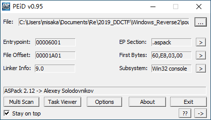
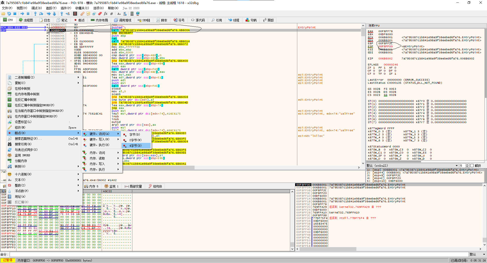
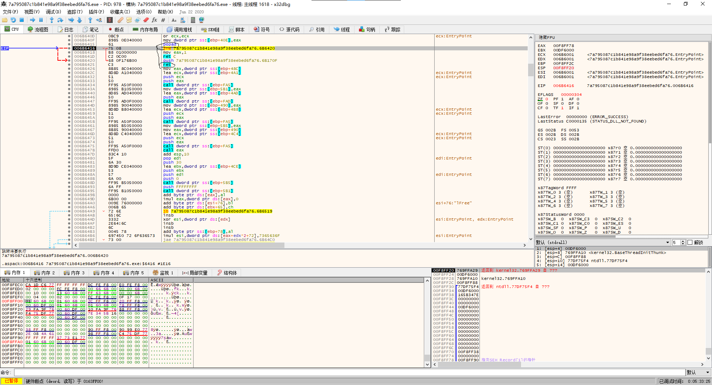
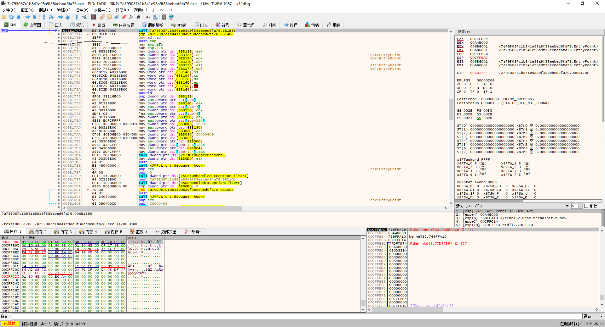
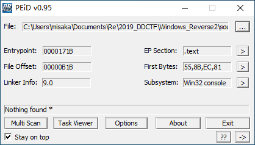
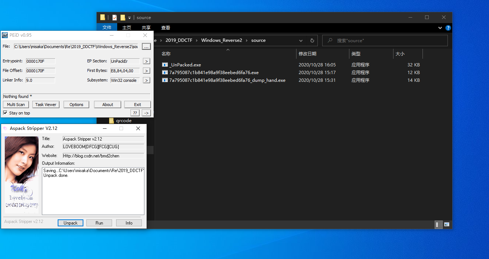

PEiD查壳(ASPack 2.12 -> Alexey Solodovnikov)



# 手动脱壳

x32dbg载入,步进到`call 6B600A`得到ESP`00F8FF00`,在此处下断点



运行到断点处,然后步进到第二个`ret`,得到`push ebp`处的地址进行dump





dump后进行查壳




main函数

```cpp
int maybe_main()
{
  char v1; // [esp+8h] [ebp-C04h]
  char v2; // [esp+9h] [ebp-C03h]
  char input; // [esp+408h] [ebp-804h]
  char v4; // [esp+409h] [ebp-803h]
  char v5; // [esp+808h] [ebp-404h]
  char v6; // [esp+809h] [ebp-403h]

  input = 0;
  memset(&v4, 0, 1023);                         // memset
  v5 = 0;
  memset(&v6, 0, 1023);                         // memset
  MEMORY[0x712420C1]("input code:");
  MEMORY[0x712426D4]("%s", &input);
  if ( !sub_6D11F0(&input) )                    // 输入必须为0~9,A~F中
  {
    MEMORY[0x712420C1]("invalid input\n");
    MEMORY[0x71232455](0);
  }
  sub_6D1240(&input, &v5);
  v1 = 0;
  memset(&v2, 0, 1023);                         // memset
  MEMORY[0x71242E73](&v1, "DDCTF{%s}", &v5);
  if ( !strcmp(&v1, "DDCTF{reverse+}") )
    MEMORY[0x712420C1]("You've got it !!! %s\n", &v1);
  else
    MEMORY[0x712420C1]("Something wrong. Try again...\n");
  return 0;
}
```

`sub_6D1240(&input, &v5);`对输入进行处理

```cpp
int __usercall sub_6D1240@<eax>(const char *input@<esi>, int a2)
{
  signed int input_len; // edi
  signed int index; // edx
  char v4; // bl
  char each; // al
  char each_1; // al
  unsigned int v7; // ecx
  char v9; // [esp+Bh] [ebp-405h]
  char v10; // [esp+Ch] [ebp-404h]
  char v11; // [esp+Dh] [ebp-403h]

  input_len = strlen(input);
  v10 = 0;
  memset(&v11, 0, 1023);
  index = 0;
  if ( input_len > 0 )
  {
    v4 = v9;
    do
    {
      each = input[index];
      if ( (input[index] - 48) > 9u )           // A~F转换为10~15
      {
        if ( (each - 65) <= 5u )
          v9 = each - 55;
      }
      else
      {
        v9 = input[index] - 48;                 // 0~9
      }
      each_1 = input[index + 1];
      if ( (input[index + 1] - 48) > 9u )
      {
        if ( (each_1 - 65) <= 5u )
          v4 = each_1 - 55;
      }
      else
      {
        v4 = input[index + 1] - 48;
      }
      v7 = index >> 1;
      index += 2;
      *(&v10 + v7) = v4 | 16 * v9;
    }
    while ( index < input_len );
  }
  return sub_6D1000(input_len / 2, a2);
}
```

`sub_6D1000(input_len / 2, a2);`真正的处理

```cpp
int __cdecl sub_6D1000(int a1, int a2)
{
  char *v2; // ecx
  int v3; // ebp
  char *v4; // edi
  signed int v5; // esi
  unsigned __int8 v6; // bl
  signed int v7; // esi
  int v8; // edi
  int v9; // edi
  int v10; // esi
  int v11; // edi
  int *v12; // eax
  unsigned __int8 v14; // [esp+14h] [ebp-38h]
  unsigned __int8 v15; // [esp+15h] [ebp-37h]
  unsigned __int8 v16; // [esp+16h] [ebp-36h]
  int v17; // [esp+18h] [ebp-34h]
  int v18; // [esp+1Ch] [ebp-30h]
  char v19; // [esp+20h] [ebp-2Ch]
  int *v20; // [esp+24h] [ebp-28h]
  int v21; // [esp+34h] [ebp-18h]
  unsigned int v22; // [esp+38h] [ebp-14h]
  int v23; // [esp+48h] [ebp-4h]

  v3 = a1;
  v4 = v2;                                      // string:  reverse+
  v18 = a2;
  MEMORY[0x74A15E81](&v19);                     // allocator
  v5 = 0;
  v23 = 0;
  if ( a1 )
  {
    do
    {
      *(&v14 + v5) = *v4;
      v6 = v15;
      ++v5;
      --v3;
      ++v4;
      if ( v5 == 3 )
      {                                         // base64
        LOBYTE(v17) = v14 >> 2;
        BYTE1(v17) = (v15 >> 4) + 16 * (v14 & 3);
        BYTE2(v17) = (v16 >> 6) + 4 * (v15 & 0xF);
        HIBYTE(v17) = v16 & 0x3F;
        v7 = 0;
        do
          MEMORY[0x74A172EE](&v19, (byte_6D3020[*(&v17 + v7++)] ^ 0x76));// allocator
                                                // base64改表+异或
        while ( v7 < 4 );
        v5 = 0;
      }
    }
    while ( v3 );
    if ( v5 )
    {
      if ( v5 < 3 )
      {
        memset((&v14 + v5), 0, 3 - v5);
        v6 = v15;
      }
      BYTE1(v17) = (v6 >> 4) + 16 * (v14 & 3);
      LOBYTE(v17) = v14 >> 2;
      BYTE2(v17) = (v16 >> 6) + 4 * (v6 & 0xF);
      v8 = 0;
      for ( HIBYTE(v17) = v16 & 0x3F; v8 < v5 + 1; ++v8 )
        MEMORY[0x74A172EE](&v19, (byte_6D3020[*(&v17 + v8)] ^ 0x76));
      if ( v5 < 3 )
      {
        v9 = 3 - v5;
        do
        {
          MEMORY[0x74A172EE](&v19, '=');
          --v9;
        }
        while ( v9 );
      }
    }
  }
  v10 = v21;
  v11 = v18;
  memset(v18, 0, v21 + 1);
  v12 = v20;
  if ( v22 < 0x10 )
    v12 = &v20;
  sub_6D1C64(v11, v12, v10);                    // memcpy
  v23 = -1;
  return MEMORY[0x74A15EBB]();
}
```

```py
base64_table=[55, 52, 53, 50, 51, 48, 49, 62, 63, 60, 61, 58, 59, 56, 57, 38, 39, 36, 37, 34, 35, 32, 33, 46, 47, 44, 23, 20, 21, 18, 19, 16, 17, 30, 31, 28, 29, 26, 27, 24, 25, 6, 7, 4, 5, 2, 3, 0, 1, 14, 15, 12, 70, 71, 68, 69, 66, 67, 64, 65, 78, 79, 93, 89]
s="reverse+"
s_list=[4, 19, 0, 19, 4, 5, 19, 93]#s^0x76
s_posi=[43, 30, 47, 30, 43, 44, 30, 62]#s_list在base64改表中的对应位置
for i in s_posi:
    print(bin(i)[2:].zfill(8))

'''
00101011
00011110
00101111
00011110
00101011
00101100
00011110
00111110

hex(0b10101101) ad
hex(0b11101011) eb
hex(0b11011110) de

hex(0b10101110) ae
hex(0b11000111) c7
hex(0b10111110) be

flag:DDCTF{ADEBDEAEC7BE}
'''
```

# 工具脱壳



```cpp
int __cdecl main(int argc, const char **argv, const char **envp)
{
  char Dest; // [esp+8h] [ebp-C04h]
  char v5; // [esp+9h] [ebp-C03h]
  char v6; // [esp+408h] [ebp-804h]
  char Dst; // [esp+409h] [ebp-803h]
  char v8; // [esp+808h] [ebp-404h]
  char v9; // [esp+809h] [ebp-403h]

  v6 = 0;
  memset(&Dst, 0, 0x3FFu);
  v8 = 0;
  memset(&v9, 0, 0x3FFu);
  printf(Format);
  scanf(aS, &v6);
  if ( !(unsigned __int8)sub_7411F0() )
  {
    printf(aInvalidInput);
    exit(0);
  }
  sub_741240(&v8);
  Dest = 0;
  memset(&v5, 0, 0x3FFu);
  sprintf(&Dest, aDdctfS, &v8);
  if ( !strcmp(&Dest, aDdctfReverse) )
    printf(aYouVeGotItS, &Dest);
  else
    printf(aSomethingWrong);
  return 0;
}
```

```cpp
int __usercall sub_741240@<eax>(const char *a1@<esi>, int a2)
{
  signed int v2; // edi
  signed int v3; // edx
  char v4; // bl
  char v5; // al
  char v6; // al
  unsigned int v7; // ecx
  char v9; // [esp+Bh] [ebp-405h]
  char v10; // [esp+Ch] [ebp-404h]
  char Dst; // [esp+Dh] [ebp-403h]

  v2 = strlen(a1);
  v10 = 0;
  memset(&Dst, 0, 0x3FFu);
  v3 = 0;
  if ( v2 > 0 )
  {
    v4 = v9;
    do
    {
      v5 = a1[v3];
      if ( (unsigned __int8)(a1[v3] - 48) > 9u )
      {
        if ( (unsigned __int8)(v5 - 65) <= 5u )
          v9 = v5 - 55;
      }
      else
      {
        v9 = a1[v3] - 48;
      }
      v6 = a1[v3 + 1];
      if ( (unsigned __int8)(a1[v3 + 1] - 48) > 9u )
      {
        if ( (unsigned __int8)(v6 - 65) <= 5u )
          v4 = v6 - 55;
      }
      else
      {
        v4 = a1[v3 + 1] - 48;
      }
      v7 = (unsigned int)v3 >> 1;
      v3 += 2;
      *(&v10 + v7) = v4 | 16 * v9;
    }
    while ( v3 < v2 );
  }
  return sub_741000(v2 / 2, a2);
}
```

```cpp
int __cdecl sub_741000(int a1, void *a2)
{
  char *v2; // ecx
  int v3; // ebp
  char *v4; // edi
  signed int v5; // esi
  unsigned __int8 v6; // bl
  signed int v7; // esi
  int v8; // edi
  int v9; // edi
  size_t v10; // esi
  void *v11; // edi
  const void *v12; // eax
  unsigned __int8 Dst; // [esp+14h] [ebp-38h]
  unsigned __int8 v15; // [esp+15h] [ebp-37h]
  unsigned __int8 v16; // [esp+16h] [ebp-36h]
  char v17; // [esp+18h] [ebp-34h]
  char v18; // [esp+19h] [ebp-33h]
  char v19; // [esp+1Ah] [ebp-32h]
  char i; // [esp+1Bh] [ebp-31h]
  void *v21; // [esp+1Ch] [ebp-30h]
  char v22; // [esp+20h] [ebp-2Ch]
  void *Src; // [esp+24h] [ebp-28h]
  size_t Size; // [esp+34h] [ebp-18h]
  unsigned int v25; // [esp+38h] [ebp-14h]
  int v26; // [esp+48h] [ebp-4h]

  v3 = a1;
  v4 = v2;
  v21 = a2;
  std::basic_string<char,std::char_traits<char>,std::allocator<char>>::basic_string<char,std::char_traits<char>,std::allocator<char>>(&v22);
  v5 = 0;
  v26 = 0;
  if ( a1 )
  {
    do
    {
      *(&Dst + v5) = *v4;
      v6 = v15;
      ++v5;
      --v3;
      ++v4;
      if ( v5 == 3 )
      {
        v17 = Dst >> 2;
        v18 = (v15 >> 4) + 16 * (Dst & 3);
        v19 = (v16 >> 6) + 4 * (v15 & 0xF);
        i = v16 & 0x3F;
        v7 = 0;
        do
          std::basic_string<char,std::char_traits<char>,std::allocator<char>>::operator+=(
            &v22,
            (unsigned __int8)(byte_743020[(unsigned __int8)*(&v17 + v7++)] ^ 0x76));
        while ( v7 < 4 );
        v5 = 0;
      }
    }
    while ( v3 );
    if ( v5 )
    {
      if ( v5 < 3 )
      {
        memset(&Dst + v5, 0, 3 - v5);
        v6 = v15;
      }
      v18 = (v6 >> 4) + 16 * (Dst & 3);
      v17 = Dst >> 2;
      v19 = (v16 >> 6) + 4 * (v6 & 0xF);
      v8 = 0;
      for ( i = v16 & 0x3F; v8 < v5 + 1; ++v8 )
        std::basic_string<char,std::char_traits<char>,std::allocator<char>>::operator+=(
          &v22,
          (unsigned __int8)(byte_743020[(unsigned __int8)*(&v17 + v8)] ^ 0x76));
      if ( v5 < 3 )
      {
        v9 = 3 - v5;
        do
        {
          std::basic_string<char,std::char_traits<char>,std::allocator<char>>::operator+=(&v22, 61);
          --v9;
        }
        while ( v9 );
      }
    }
  }
  v10 = Size;
  v11 = v21;
  memset(v21, 0, Size + 1);
  v12 = Src;
  if ( v25 < 0x10 )
    v12 = &Src;
  memcpy(v11, v12, v10);
  v26 = -1;
  return std::basic_string<char,std::char_traits<char>,std::allocator<char>>::~basic_string<char,std::char_traits<char>,std::allocator<char>>();
}
```