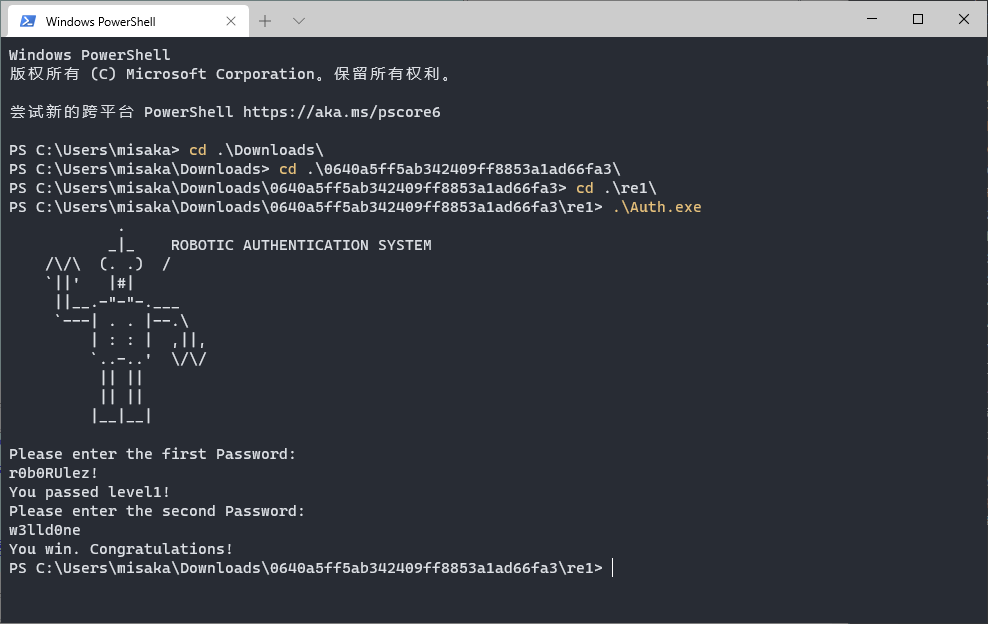

进行动态调试

main函数

```cpp
int __cdecl main(int argc, const char **argv, const char **envp)
{
  const CHAR *v3; // ebx
  HMODULE v4; // eax
  void (__stdcall *v5)(HMODULE, LPCSTR); // eax
  char v7; // [esp+1h] [ebp-157h]
  char v8[4]; // [esp+15h] [ebp-143h]
  int v9; // [esp+20h] [ebp-138h]
  int v10; // [esp+26h] [ebp-132h]
  int v11; // [esp+2Ah] [ebp-12Eh]
  int v12; // [esp+2Eh] [ebp-12Ah]
  int v13; // [esp+32h] [ebp-126h]
  int v14; // [esp+36h] [ebp-122h]
  int v15; // [esp+3Ah] [ebp-11Eh]
  __int16 v16; // [esp+3Eh] [ebp-11Ah]
  int v17; // [esp+40h] [ebp-118h]
  int v18; // [esp+44h] [ebp-114h]
  int v19; // [esp+48h] [ebp-110h]
  int v20; // [esp+4Ch] [ebp-10Ch]
  int v21; // [esp+50h] [ebp-108h]
  int v22; // [esp+54h] [ebp-104h]
  int v23; // [esp+58h] [ebp-100h]
  int v24; // [esp+5Ch] [ebp-FCh]
  int v25; // [esp+60h] [ebp-F8h]
  int v26; // [esp+64h] [ebp-F4h]
  int v27; // [esp+68h] [ebp-F0h]
  int v28; // [esp+6Ch] [ebp-ECh]
  int v29; // [esp+70h] [ebp-E8h]
  char v30; // [esp+74h] [ebp-E4h]
  int v31; // [esp+75h] [ebp-E3h]
  int v32; // [esp+79h] [ebp-DFh]
  int v33; // [esp+7Dh] [ebp-DBh]
  int v34; // [esp+81h] [ebp-D7h]
  int v35; // [esp+85h] [ebp-D3h]
  int v36; // [esp+89h] [ebp-CFh]
  int v37; // [esp+8Dh] [ebp-CBh]
  int v38; // [esp+91h] [ebp-C7h]
  __int16 v39; // [esp+95h] [ebp-C3h]
  int v40; // [esp+97h] [ebp-C1h]
  int v41; // [esp+9Bh] [ebp-BDh]
  int v42; // [esp+9Fh] [ebp-B9h]
  int v43; // [esp+A3h] [ebp-B5h]
  int v44; // [esp+A7h] [ebp-B1h]
  int v45; // [esp+ABh] [ebp-ADh]
  int v46; // [esp+AFh] [ebp-A9h]
  int v47; // [esp+B3h] [ebp-A5h]
  char v48; // [esp+B7h] [ebp-A1h]
  int v49; // [esp+B8h] [ebp-A0h]
  int v50; // [esp+BEh] [ebp-9Ah]
  int v51; // [esp+C2h] [ebp-96h]
  int v52; // [esp+C6h] [ebp-92h]
  int v53; // [esp+CAh] [ebp-8Eh]
  int v54; // [esp+CEh] [ebp-8Ah]
  int v55; // [esp+D2h] [ebp-86h]
  int v56; // [esp+D6h] [ebp-82h]
  int v57; // [esp+DAh] [ebp-7Eh]
  char v58; // [esp+DEh] [ebp-7Ah]
  int v59; // [esp+DFh] [ebp-79h]
  int v60; // [esp+E3h] [ebp-75h]
  int v61; // [esp+E7h] [ebp-71h]
  int v62; // [esp+EBh] [ebp-6Dh]
  int v63; // [esp+EFh] [ebp-69h]
  int v64; // [esp+F3h] [ebp-65h]
  int v65; // [esp+F7h] [ebp-61h]
  int v66; // [esp+FBh] [ebp-5Dh]
  __int16 v67; // [esp+FFh] [ebp-59h]
  int v68; // [esp+101h] [ebp-57h]
  int v69; // [esp+105h] [ebp-53h]
  char v70; // [esp+109h] [ebp-4Fh]
  int v71; // [esp+10Ah] [ebp-4Eh]
  int v72; // [esp+10Eh] [ebp-4Ah]
  int v73; // [esp+112h] [ebp-46h]
  int v74; // [esp+116h] [ebp-42h]
  int v75; // [esp+11Ah] [ebp-3Eh]
  int v76; // [esp+11Eh] [ebp-3Ah]
  int v77; // [esp+122h] [ebp-36h]
  int v78; // [esp+126h] [ebp-32h]
  int v79; // [esp+12Ah] [ebp-2Eh]
  int v80; // [esp+12Eh] [ebp-2Ah]
  int v81; // [esp+132h] [ebp-26h]
  int v82; // [esp+136h] [ebp-22h]
  int v83; // [esp+13Ah] [ebp-1Eh]
  int v84; // [esp+13Eh] [ebp-1Ah]
  int v85; // [esp+142h] [ebp-16h]
  int v86; // [esp+146h] [ebp-12h]
  int v87; // [esp+14Ah] [ebp-Eh]
  __int16 v88; // [esp+14Eh] [ebp-Ah]
  int *v89; // [esp+150h] [ebp-8h]

  v89 = &argc;
  sub_402940();
  puts(
    "            .     \n"
    "           _|_    ROBOTIC AUTHENTICATION SYSTEM\n"
    "    /\\/\\  (. .)  /\n"
    "    `||'   |#|  \n"
    "     ||__.-\"-\"-.___   \n"
    "     `---| . . |--.\\  \n"
    "         | : : |  ,||,\n"
    "         `..-..'  \\/\\/\n"
    "          || ||   \n"
    "          || ||    \n"
    "         |__|__|  \n");
  v49 = 1337;
  v50 = 1617194321;
  v51 = 1679910002;
  v52 = 1935963503;
  v53 = 1684632865;
  v54 = 1936221985;
  v55 = 1361147250;
  v56 = 1987211872;
  v57 = 996504430;
  v58 = 1;
  v40 = 1617194321;
  v41 = 1679910002;
  v42 = 1935963503;
  v43 = 1684632865;
  v44 = 1936221985;
  v45 = 1361147250;
  v46 = 1987211872;
  v47 = 996504430;
  v48 = 1;
  v59 = 1617194321;
  v60 = 1679910002;
  v61 = 1935963503;
  v62 = 1684632865;
  v63 = 1650749985;
  v64 = 560295790;
  v65 = 1920098385;
  v66 = 1702063734;
  v67 = 315;
  v31 = 1617194321;
  v32 = 1679910002;
  v33 = 1935963503;
  v34 = 1684632865;
  v35 = 1650749985;
  v36 = 560295790;
  v37 = 1920098385;
  v38 = 1702063734;
  v39 = 315;
  v68 = 1869557876;
  v69 = 1718432615;
  v70 = 3;
  v28 = 1869557876;
  v29 = 1718432615;
  v30 = 3;
  v71 = 1869833322;
  v72 = 858942820;
  v73 = 1835885871;
  v74 = 20906241;
  v24 = 1869833322;
  v25 = 858942820;
  v26 = 1835885871;
  v27 = 20906241;
  v75 = 1466262848;
  v76 = 1853186660;
  v77 = 1147495539;
  v78 = 1902404217;
  v79 = 1869506677;
  v80 = 1701797961;
  v81 = 24339565;
  v17 = 1466262848;
  v18 = 1853186660;
  v19 = 1147495539;
  v20 = 1902404217;
  v21 = 1869506677;
  v22 = 1701797961;
  v23 = 24339565;
  v82 = 561278552;
  v83 = 795830390;
  v84 = 1869496865;
  v85 = 1969255270;
  v86 = 1969253748;
  v87 = 1919905384;
  v88 = 288;
  v10 = 561278552;
  v11 = 795830390;
  v12 = 1869496865;
  v13 = 1969255270;
  v14 = 1969253748;
  v15 = 1919905384;
  v16 = 288;
  v9 = 1337;
  strcpy(v8, "r0b0RUlez!");
  dword_40AD94 = (int)&v9;
  dword_40ADA0 = (int)&v49;
  plz_enter_first_pwd = (char *)&v40;
  plz_enter_second_pwd = (char *)&v31;
  dword_40AD98 = (int)&v28;
  lpProcName = (LPCSTR)&v17;
  lpModuleName = (LPCSTR)&v24;
  dword_40ADA4 = (char *)&v10;
  sub_401500(0);
  v3 = lpProcName;
  v4 = GetModuleHandleA(lpModuleName);          // kernel32.dll
  v5 = (void (__stdcall *)(HMODULE, LPCSTR))GetProcAddress(v4, v3);// AddVectoredExceptionHandler
  v5((HMODULE)1, (LPCSTR)sub_40157F);
  puts(plz_enter_first_pwd);
  scanf("%20s", &v7);
  if ( !strcmp(&v7, v8) )
  {
    puts("You passed level1!");
    sub_4015EA(0);
  }
  return 0;
}
```

`v8`被赋值为`r0b0RUlez!`

`sub_401500`用于对`lpProcName`等字符串进行变换,变换完成后`lpProcName`为`AddVectoredExceptionHandler`(功能是在异常前执行指定函数),`lpModuleName`为`kernel32.dll`

第一个密码输入`r0b0RUlez!`,可以进入第二关

```cpp
int __cdecl sub_4015EA(signed int a1)
{
  if ( a1 <= 9 )
    return sub_4015EA(a1 + 1);
  puts(plz_enter_second_pwd);
  dword_40ADA8 = 4199961;
  __debugbreak();
  return 0;
}
```

查看汇编代码

```s
.text:00401607 loc_401607:                             ; CODE XREF: sub_4015EA+A↑j
.text:00401607 mov     eax, ds:plz_enter_second_pwd
.text:0040160C mov     [esp], eax                      ; char *
.text:0040160F call    puts
.text:00401614 call    $+5
.text:00401619 pop     eax
.text:0040161A mov     ds:dword_40ADA8, eax
.text:0040161F int     3                               ; Trap to Debugger
.text:00401620 mov     eax, 0
.text:00401625
.text:00401625 locret_401625:                          ; CODE XREF: sub_4015EA+1B↑j
.text:00401625 leave
.text:00401626 retn
.text:00401626 sub_4015EA endp
```


**注意**

```s
.text:00401614 call    $+5
.text:00401619 pop     eax
```

`call $+5`(从当前开始向下五个字节处开始执行)也就是跳转到`pop eax`,看起来和直接跳到下一条指令没什么区别

但实际上,`call`会把下一条要执行的指令地址压栈,这里也就是把`00401619`压栈,再`pop eax`,这时eax就是`00401619`

```s
.text:0040161F int     3   
```

有一个`int 3`的异常,可以被`AddVectoredExceptionHandler`捕捉,由`v5((HMODULE)1, (LPCSTR)sub_40157F);`进入`sub_40157F`

```cpp
void __cdecl __noreturn sub_40157F(int a1)
{
  char v1; // [esp+18h] [ebp-20h]
  int v2; // [esp+2Ch] [ebp-Ch]

  v2 = *(_DWORD *)(*(_DWORD *)(a1 + 4) + 184);
  if ( v2 == dword_40ADA8 + 6 )
  {
    scanf("%20s", &v1);
    if ( !sub_401547(&v1, (_BYTE *)dword_40AD98) )
      puts(dword_40ADA4);
  }
  ExitProcess(0);
}
```

```cpp
signed int __cdecl sub_401547(_BYTE *a1, _BYTE *a2)
{
  while ( *a2 != 2 )
  {
    if ( *a1 != (*a2 ^ 2) )
      return 1;
    ++a1;
    ++a2;
  }
  return 0;
}
```

`dword_40AD98`为`[117, 49, 110, 110, 102, 50, 108, 103]`

由此可得第二关的密码

```python
dword_40AD98=[117, 49, 110, 110, 102, 50, 108, 103]
for i in dword_40AD98:
    print(chr(i^2),end="")
```

`w3lld0ne`



flag为`flag{r0b0RUlez!_w3lld0ne}`