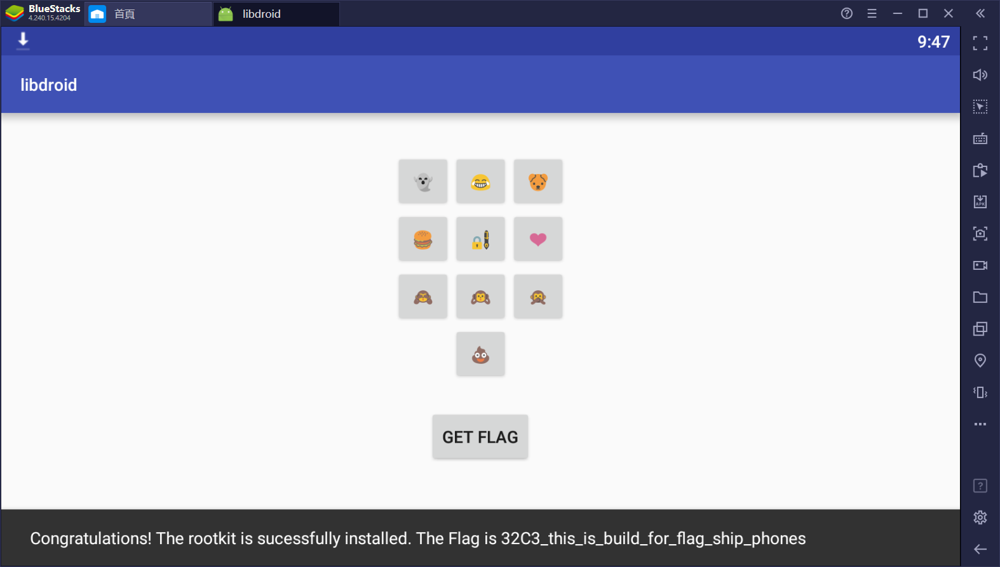

通过jadx得到部分代码,同时通过ida反编译so文件得到原生函数代码

```java
package ctf.stratumauhhur.libdroid;

import android.os.Bundle;
import android.support.design.widget.Snackbar;
import android.support.v7.app.AppCompatActivity;
import android.util.Base64;
import android.view.View;
import java.io.BufferedReader;
import java.io.ByteArrayInputStream;
import java.io.ByteArrayOutputStream;
import java.io.InputStream;
import java.io.InputStreamReader;

public class a extends AppCompatActivity {
    static String a = a(getOperatingSystem(), 1);//0x10 0xF4 0x52 0xB2 0x1F 0xF9 0x55 0xFA 0x13 0xFC
    static String b = a(getPhoneNumber(), 1);//0x11 0xF7 0x5D 0xB6 0x1A 0xFF 0x19 0xFF 0x1C 0xF7 0x0C 0xE9
    static String c = a(installRootkit(), 1);//0x30 0xF4 0x52 0xB3 0x04 0xFF 0x0F 0xE6 0x11 0xF4
    static String d = a(generateConfusion(), 1);//0x53 0xAA 0x0E 0xE7 0x42 0xAB 0x4D 0xA4 0x45 0xAC 0x50
    static Object f = a(obtainWorldDomination(), 1);//0x18 0xFE 0x45 0xE9
    static String flag = a(getFlag(), 1);//0x20 0xF4 0x4E 0xA6 0x0F 0xBE 0x15 0xFC 0x5D 0xE7 0x0F 0xE7 0x02 0xF5 0x19 0xEC 0x5B 0xF5 0x11 0xE4 0x1C 0xAD 0x0F 0xFD 0x47 0xB5 0x52
    static String g = a(installiOS(), 1);//0x01 0xF4 0x53 0xA0 0x1D 0xF7 0x0F 0xAE
    /*
    上述静态函数均为(string,int)类型,调用了static String a(String a2, int b2)这个函数
    a="config.ini"
    b="blablablabla"
    c="Congratula"
    d=" 1234567890"
    f="key="
    flag="Sorry no rootkit for you :("
    file_name="rootkit="
    然后跳转到onCreate函数
    */
    String e;

    public static native String generateConfusion();

    public static native String getFlag();

    public static native String getOperatingSystem();

    public static native String getPhoneNumber();

    public static native String installRootkit();

    public static native String installiOS();

    public static native String obtainWorldDomination();

    private static native void phoneHome(byte[] bArr, byte[] bArr2);

    /* access modifiers changed from: protected */
    @Override // android.support.v7.app.AppCompatActivity, android.support.v4.app.FragmentActivity, android.support.v4.app.BaseFragmentActivityDonut
    public void onCreate(Bundle savedInstanceState) {
        super.onCreate(savedInstanceState);
        setContentView(R.layout.activity_a);
        try {
            a(a);//public void a(String a2) throws Exception,a="config.ini"
        } catch (Exception e2) {
        }
        this.e = "";
    }

    /* access modifiers changed from: package-private */
    public byte[] a(byte[] a0, String a1) {
        byte[] a2 = new byte[a0.length];
        for (char a3 = 0; a3 < a2.length; a3 = (char) (a3 + 1)) {
            a2[a3] = (byte) (a0[a3] ^ a1.charAt(a3 % a1.length()));
        }
        return a2;
    }

    public void a(View v) {//点击按钮,触发事件
        //d=" 1234567890"
        if (v.getId() == R.id.button) {
            this.e += d.charAt(1);
        }
        if (v.getId() == R.id.button2) {
            this.e += d.charAt(2);
        }
        if (v.getId() == R.id.button3) {
            this.e += d.charAt(3);
        }
        if (v.getId() == R.id.button4) {
            this.e += d.charAt(4);
        }
        if (v.getId() == R.id.button5) {
            this.e += d.charAt(5);
        }
        if (v.getId() == R.id.button6) {
            this.e += d.charAt(6);
        }
        if (v.getId() == R.id.button7) {
            this.e += d.charAt(7);
        }
        if (v.getId() == R.id.button8) {
            this.e += d.charAt(8);
        }
        if (v.getId() == R.id.button9) {
            this.e += d.charAt(9);
        }
        if (v.getId() == R.id.button10) {
            this.e += d.charAt(0);
        }
        if (this.e.length() == 6 || v.getId() == R.id.button11) {
            String flag2 = flag;
            try {
                InputStream b2 = getAssets().open(g);//打开"assets/a/d/c/c"
                ByteArrayOutputStream b22 = new ByteArrayOutputStream();
                byte[] data = new byte[16384];
                while (true) {
                    int nRead = b2.read(data, 0, data.length);
                    if (nRead == -1) {
                        break;
                    }
                    b22.write(data, 0, nRead);
                }
                b22.flush();
                byte[] j = b22.toByteArray();
                /*j=FEA0AD802059AB12D7C39C88FA2C1DFC81460DDCE9CECC5778F5415F520236D53318663A4026E86EB6CD72B73C0166B14F9923639577346169F6A953403741434F98952C7A273C98681A88A8B785BB154F1A014DC9C89B7578577F980DD851A822B95E594D714F1A81A9BF0729EDFD83*/
                byte[] f_ = new byte[16];
                System.arraycopy((byte[]) f, 0, f_, 0, ((byte[]) f).length);
                System.arraycopy(this.e.getBytes(), 0, f_, 10, this.e.getBytes().length);
                /*f_的前十个为b'!\x00\x86\xb7\xff\x86]\x06-0',后六个为按钮代表的字符*/
                phoneHome(j, f_);//根据phoneHome函数进行爆破
                if (new String(j).startsWith(c)) {//如果以"Congratula"开头
                    flag2 = new String(j);
                }
            } catch (Exception e1) {
                e1.printStackTrace();
            }
            Snackbar.make(v, flag2, 0).setAction("Action", (View.OnClickListener) null).show();
            this.e = "";
        }
    }

    /* access modifiers changed from: package-private */
    public void a(String a2) throws Exception {
        InputStream b2 = getAssets().open(a2);//打开"config.ini"
        /*
        <root>
        key=IQCGt/+GXQYtMA==
        rootkit=a/d/c/c
        </root>
        */
        ByteArrayOutputStream b22 = new ByteArrayOutputStream();
        byte[] data = new byte[16384];
        while (true) {
            int nRead = b2.read(data, 0, data.length);
            if (nRead == -1) {
                break;
            }
            b22.write(data, 0, nRead);
        }
        b22.flush();
        BufferedReader b4 = new BufferedReader(new InputStreamReader(new ByteArrayInputStream(a(b22.toByteArray(), b))));
        while (true) {
            String c2 = b4.readLine();//逐行读取
            if (c2 != null) {
                if (c2.startsWith(g)) {//若以g开头,g="rootkit="
                    g = c2.substring(g.length());//g的值被更新,g="a/d/c/c"
                }
                if (c2.startsWith((String) f)) {//f="key="
                    f = Base64.decode(c2.substring(((String) f).length()), 0);//f的值被更新,f=b'!\x00\x86\xb7\xff\x86]\x06-0'
                }
            } else {
                return;
            }
        }
    }

    /* JADX INFO: Multiple debug info for r1v1 java.lang.String: [D('a1' java.lang.String), D('a1' java.lang.StringBuilder)] */
    static String a(String a2, int b2) {//b2恒等于1
        StackTraceElement a0 = new Exception().getStackTrace()[b2];
        StringBuilder a1 = new StringBuilder();
        a1.append(a0.getClassName()).insert(b2, a0.getMethodName());
        //a0.getClassName()=ctf.stratumauhhur.libdroid.a
        //a0.getMethodName()=<clinit>
        //a1=c<clinit>tf.stratumauhhur.libdroid.a
        String a12 = a1.toString();
        char[] a22 = new char[a2.length()];
        char a4 = 0;
        char a3 = (char) a12.length();
        while (a4 < a2.length()) {
            a22[a4] = (char) (a12.charAt(a3 - 1) ^ (a2.charAt(a4) ^ 18));
            char a42 = (char) (a4 + 1);
            if (a42 >= a2.length()) {
                break;
            }
            a22[a42] = (char) (a12.charAt(a3 - 1) ^ (a2.charAt(a42) ^ 250));
            a4 = (char) (a42 + 1);
            a3 = (char) (a3 - 1);
            if (a3 <= 0) {
                a3 = (char) a12.length();
            }
        }
        return String.valueOf(a22);
    }

    static {
        System.loadLibrary("libdroid");
    }
}
```

```cpp
int __cdecl Java_ctf_stratumauhhur_libdroid_a_getOperatingSystem(int *a1)
{
  int v1; // edx
  __int16 v3; // [esp+1Ch] [ebp-20h]
  __int16 v4; // [esp+1Eh] [ebp-1Eh]
  __int16 v5; // [esp+20h] [ebp-1Ch]
  __int16 v6; // [esp+22h] [ebp-1Ah]
  __int16 v7; // [esp+24h] [ebp-18h]
  __int16 v8; // [esp+26h] [ebp-16h]
  __int16 v9; // [esp+28h] [ebp-14h]
  __int16 v10; // [esp+2Ah] [ebp-12h]
  __int16 v11; // [esp+2Ch] [ebp-10h]
  __int16 v12; // [esp+2Eh] [ebp-Eh]

  v3 = 0x10;
  v4 = 0xF4;
  v1 = *a1;
  v5 = 0x52;
  v6 = 0xB2;
  v7 = 0x1F;
  v8 = 0xF9;
  v9 = 0x55;
  v10 = 0xFA;
  v11 = 0x13;
  v12 = 0xFC;
  return (*(v1 + 652))(a1, &v3, 10);
}
```

```cpp
int __cdecl Java_ctf_stratumauhhur_libdroid_a_getPhoneNumber(int *a1)
{
  int v1; // edx
  __int16 v3; // [esp+18h] [ebp-24h]
  __int16 v4; // [esp+1Ah] [ebp-22h]
  __int16 v5; // [esp+1Ch] [ebp-20h]
  __int16 v6; // [esp+1Eh] [ebp-1Eh]
  __int16 v7; // [esp+20h] [ebp-1Ch]
  __int16 v8; // [esp+22h] [ebp-1Ah]
  __int16 v9; // [esp+24h] [ebp-18h]
  __int16 v10; // [esp+26h] [ebp-16h]
  __int16 v11; // [esp+28h] [ebp-14h]
  __int16 v12; // [esp+2Ah] [ebp-12h]
  __int16 v13; // [esp+2Ch] [ebp-10h]
  __int16 v14; // [esp+2Eh] [ebp-Eh]

  v3 = 0x11;
  v4 = 0xF7;
  v1 = *a1;
  v5 = 0x5D;
  v6 = 0xB6;
  v7 = 0x1A;
  v8 = 0xFF;
  v9 = 0x19;
  v10 = 0xFF;
  v11 = 0x1C;
  v12 = 0xF7;
  v13 = 0xC;
  v14 = 0xE9;
  return (*(v1 + 652))(a1, &v3, 12);
}
```

```cpp
int __cdecl Java_ctf_stratumauhhur_libdroid_a_generateConfusion(int *a1)
{
  int v1; // edx
  __int16 v3; // [esp+1Ah] [ebp-22h]
  __int16 v4; // [esp+1Ch] [ebp-20h]
  __int16 v5; // [esp+1Eh] [ebp-1Eh]
  __int16 v6; // [esp+20h] [ebp-1Ch]
  __int16 v7; // [esp+22h] [ebp-1Ah]
  __int16 v8; // [esp+24h] [ebp-18h]
  __int16 v9; // [esp+26h] [ebp-16h]
  __int16 v10; // [esp+28h] [ebp-14h]
  __int16 v11; // [esp+2Ah] [ebp-12h]
  __int16 v12; // [esp+2Ch] [ebp-10h]
  __int16 v13; // [esp+2Eh] [ebp-Eh]

  v3 = 0x53;
  v4 = 0xAA;
  v1 = *a1;
  v5 = 0xE;
  v6 = 0xE7;
  v7 = 0x42;
  v8 = 0xAB;
  v9 = 0x4D;
  v10 = 0xA4;
  v11 = 0x45;
  v12 = 0xAC;
  v13 = 0x50;
  return (*(v1 + 652))(a1, &v3, 11);
}
```

```cpp
int __cdecl Java_ctf_stratumauhhur_libdroid_a_getFlag(int *a1)
{
  int v1; // edx
  __int16 v3; // [esp+1Ah] [ebp-42h]
  __int16 v4; // [esp+1Ch] [ebp-40h]
  __int16 v5; // [esp+1Eh] [ebp-3Eh]
  __int16 v6; // [esp+20h] [ebp-3Ch]
  __int16 v7; // [esp+22h] [ebp-3Ah]
  __int16 v8; // [esp+24h] [ebp-38h]
  __int16 v9; // [esp+26h] [ebp-36h]
  __int16 v10; // [esp+28h] [ebp-34h]
  __int16 v11; // [esp+2Ah] [ebp-32h]
  __int16 v12; // [esp+2Ch] [ebp-30h]
  __int16 v13; // [esp+2Eh] [ebp-2Eh]
  __int16 v14; // [esp+30h] [ebp-2Ch]
  __int16 v15; // [esp+32h] [ebp-2Ah]
  __int16 v16; // [esp+34h] [ebp-28h]
  __int16 v17; // [esp+36h] [ebp-26h]
  __int16 v18; // [esp+38h] [ebp-24h]
  __int16 v19; // [esp+3Ah] [ebp-22h]
  __int16 v20; // [esp+3Ch] [ebp-20h]
  __int16 v21; // [esp+3Eh] [ebp-1Eh]
  __int16 v22; // [esp+40h] [ebp-1Ch]
  __int16 v23; // [esp+42h] [ebp-1Ah]
  __int16 v24; // [esp+44h] [ebp-18h]
  __int16 v25; // [esp+46h] [ebp-16h]
  __int16 v26; // [esp+48h] [ebp-14h]
  __int16 v27; // [esp+4Ah] [ebp-12h]
  __int16 v28; // [esp+4Ch] [ebp-10h]
  __int16 v29; // [esp+4Eh] [ebp-Eh]

  v3 = 0x20;
  v4 = 0xF4;
  v1 = *a1;
  v5 = 0x4E;
  v6 = 0xA6;
  v7 = 0xF;
  v8 = 0xBE;
  v9 = 0x15;
  v10 = 0xFC;
  v11 = 0x5D;
  v12 = 0xE7;
  v13 = 0xF;
  v14 = 0xE7;
  v15 = 2;
  v16 = 0xF5;
  v17 = 0x19;
  v18 = 0xEC;
  v19 = 0x5B;
  v20 = 0xF5;
  v21 = 0x11;
  v22 = 0xE4;
  v23 = 0x1C;
  v24 = 0xAD;
  v25 = 0xF;
  v26 = 0xFD;
  v27 = 0x47;
  v28 = 0xB5;
  v29 = 0x52;
  return (*(v1 + 652))(a1, &v3, 27);
}
```

```cpp
int __cdecl Java_ctf_stratumauhhur_libdroid_a_installRootkit(int *a1)
{
  int v1; // edx
  __int16 v3; // [esp+1Ch] [ebp-20h]
  __int16 v4; // [esp+1Eh] [ebp-1Eh]
  __int16 v5; // [esp+20h] [ebp-1Ch]
  __int16 v6; // [esp+22h] [ebp-1Ah]
  __int16 v7; // [esp+24h] [ebp-18h]
  __int16 v8; // [esp+26h] [ebp-16h]
  __int16 v9; // [esp+28h] [ebp-14h]
  __int16 v10; // [esp+2Ah] [ebp-12h]
  __int16 v11; // [esp+2Ch] [ebp-10h]
  __int16 v12; // [esp+2Eh] [ebp-Eh]

  v3 = 0x30;
  v4 = 0xF4;
  v1 = *a1;
  v5 = 0x52;
  v6 = 0xB3;
  v7 = 4;
  v8 = 0xFF;
  v9 = 0xF;
  v10 = 0xE6;
  v11 = 0x11;
  v12 = 0xF4;
  return (*(v1 + 652))(a1, &v3, 10);
}
```

```cpp
int __cdecl Java_ctf_stratumauhhur_libdroid_a_obtainWorldDomination(int *a1)
{
  int v1; // edx
  __int16 v3; // [esp+18h] [ebp-14h]
  __int16 v4; // [esp+1Ah] [ebp-12h]
  __int16 v5; // [esp+1Ch] [ebp-10h]
  __int16 v6; // [esp+1Eh] [ebp-Eh]

  v3 = 0x18;
  v4 = 0xFE;
  v1 = *a1;
  v5 = 0x45;
  v6 = 0xE9;
  return (*(v1 + 652))(a1, &v3, 4);
}
```

```cpp
int __cdecl Java_ctf_stratumauhhur_libdroid_a_installiOS(int *a1)
{
  int v1; // edx
  __int16 v3; // [esp+10h] [ebp-1Ch]
  __int16 v4; // [esp+12h] [ebp-1Ah]
  __int16 v5; // [esp+14h] [ebp-18h]
  __int16 v6; // [esp+16h] [ebp-16h]
  __int16 v7; // [esp+18h] [ebp-14h]
  __int16 v8; // [esp+1Ah] [ebp-12h]
  __int16 v9; // [esp+1Ch] [ebp-10h]
  __int16 v10; // [esp+1Eh] [ebp-Eh]

  v3 = 1;
  v4 = 0xF4;
  v1 = *a1;
  v5 = 0x53;
  v6 = 0xA0;
  v7 = 0x1D;
  v8 = 0xF7;
  v9 = 0xF;
  v10 = 0xAE;
  return (*(v1 + 652))(a1, &v3, 8);
}
```

```cpp
int __cdecl Java_ctf_stratumauhhur_libdroid_a_phoneHome(int a1, int a2, int a3, int a4)
{
  unsigned __int8 *v4; // esi
  int v5; // ecx
  int v6; // ebp
  unsigned int v7; // esi
  unsigned int v8; // edi
  unsigned int v9; // ecx
  int v10; // edi
  int v12; // [esp+14h] [ebp-28h]
  int v13; // [esp+18h] [ebp-24h]
  int v14; // [esp+1Ch] [ebp-20h]
  char *v15; // [esp+20h] [ebp-1Ch]
  unsigned int v16; // [esp+24h] [ebp-18h]
  int v17; // [esp+28h] [ebp-14h]
  int v18; // [esp+2Ch] [ebp-10h]

  v17 = (*(*a1 + 736))(a1, a3, 0);              // FEA0AD802059AB12D7C39C88FA2C1DFC81460DDCE9CECC5778F5415F520236D53318663A4026E86EB6CD72B73C0166B14F9923639577346169F6A953403741434F98952C7A273C98681A88A8B785BB154F1A014DC9C89B7578577F980DD851A822B95E594D714F1A81A9BF0729EDFD83
  v18 = (*(*a1 + 736))(a1, a4, 0);              // b'!\x00\x86\xb7\xff\x86]\x06-0'+...6?
  v4 = v18;
  v5 = (*(*a1 + 684))(a1, a3);
  v12 = (v4[2] << 16) | (v4[3] << 24) | *v4 | (v4[1] << 8);
  v13 = (v4[6] << 16) | (v4[7] << 24) | v4[4] | (v4[5] << 8);
  v14 = (v4[10] << 16) | (v4[11] << 24) | v4[8] | (v4[9] << 8);
  v6 = (v4[15] << 24) | v4[12] | (v4[13] << 8) | (v4[14] << 16);
  if ( v5 > 0 )
  {
    v15 = (v17 + 1);
    v16 = v17 + ((v5 - 1) & 0xFFFFFFF8) + 9;
    do
    {
      v7 = (*v15 << 8) | (v15[2] << 24) | *(v15 - 1) | (v15[1] << 16);
      v8 = 0xD5B7DDE0;
      v9 = (v15[4] << 8) | v15[3] | (v15[6] << 24) | (v15[5] << 16);
      do
      {
        v9 -= (v7 + v8) ^ (16 * v7 + v14) ^ (v6 + (v7 >> 5));
        v7 -= (v9 + v8) ^ (16 * v9 + v12) ^ (v13 + (v9 >> 5));
        v8 += 0x21524111;
      }
      while ( v8 );
      *(v15 - 1) = v7;
      v10 = (v15 + 8);
      *(v10 - 8) = BYTE1(v7);
      *(v10 - 7) = BYTE2(v7);
      *(v10 - 6) = HIBYTE(v7);
      *(v10 - 5) = v9;
      *(v10 - 3) = BYTE2(v9);
      *(v10 - 2) = HIBYTE(v9);
      v15 += 8;
    }
    while ( v10 != v16 );
  }
  (*(*a1 + 768))(a1, a3, v17, 0);
  return (*(*a1 + 768))(a1, a4, v18, 0);
}
```

static String a(String a2, int b2)

```python
a12="c<clinit>tf.stratumauhhur.libdroid.a"
a=[0x10,0xF4,0x52,0xB2,0x1F,0xF9,0x55,0xFA,0x13,0xFC]
b=[0x11,0xF7,0x5D,0xB6,0x1A,0xFF,0x19,0xFF,0x1C,0xF7,0x0C,0xE9]
c=[0x30,0xF4,0x52,0xB3,0x04,0xFF,0x0F,0xE6,0x11,0xF4]
d=[0x53,0xAA,0x0E,0xE7,0x42,0xAB,0x4D,0xA4,0x45,0xAC,0x50]
f=[0x18,0xFE,0x45,0xE9]
flag=[0x20,0xF4,0x4E,0xA6,0x0F,0xBE,0x15,0xFC,0x5D,0xE7,0x0F,0xE7,0x02,0xF5,0x19,0xEC,0x5B,0xF5,0x11,0xE4,0x1C,0xAD,0x0F,0xFD,0x47,0xB5,0x52]
file_name=[0x01,0xF4,0x53,0xA0,0x1D,0xF7,0x0F,0xAE]
a4=0
a3=len(a12)
a2=file_name
a22=[0 for i in range(len(a2))]
while a4<len(a2):
    a22[a4]=ord(a12[a3-1])^(a2[a4]^18)
    a42=a4+1
    if a42>=len(a2):
        break
    a22[a42]=ord(a12[a3-1])^(a2[a42]^250)
    a4=a42+1
    a3-=1
    if a3<=0:
        a3=len(a12)
for i in a22:
    print(chr(i),end="")
'''
a="config.ini"
b="blablablabla"
c="Congratula"
d=" 1234567890"
f="key="
flag="Sorry no rootkit for you :("
file_name="rootkit="
'''
```

```cpp
#include<stdio.h>

void test(unsigned char arg1,unsigned char arg2,unsigned char arg3,unsigned char arg4,unsigned char arg5,unsigned char arg6){
    unsigned char *v10;
    unsigned char v17[113]={0xFE,0xA0,0xAD,0x80,0x20,0x59,0xAB,0x12,0xD7,0xC3,0x9C,0x88,0xFA,0x2C,0x1D,0xFC,0x81,0x46,0x0D,0xDC,0xE9,0xCE,0xCC,0x57,0x78,0xF5,0x41,0x5F,0x52,0x02,0x36,0xD5,0x33,0x18,0x66,0x3A,0x40,0x26,0xE8,0x6E,0xB6,0xCD,0x72,0xB7,0x3C,0x01,0x66,0xB1,0x4F,0x99,0x23,0x63,0x95,0x77,0x34,0x61,0x69,0xF6,0xA9,0x53,0x40,0x37,0x41,0x43,0x4F,0x98,0x95,0x2C,0x7A,0x27,0x3C,0x98,0x68,0x1A,0x88,0xA8,0xB7,0x85,0xBB,0x15,0x4F,0x1A,0x01,0x4D,0xC9,0xC8,0x9B,0x75,0x78,0x57,0x7F,0x98,0x0D,0xD8,0x51,0xA8,0x22,0xB9,0x5E,0x59,0x4D,0x71,0x4F,0x1A,0x81,0xA9,0xBF,0x07,0x29,0xED,0xFD,0x83};
    unsigned char v18[16]={0x21,0x00,0x86,0xb7,0xff,0x86,0x5d,0x06,0x2d,0x30};
    v18[10]=arg1;
    v18[11]=arg2;
    v18[12]=arg3;
    v18[13]=arg4;
    v18[14]=arg5;
    v18[15]=arg6;
    unsigned int v12 = (v18[2] << 16) | (v18[3] << 24) | *v18 | (v18[1] << 8);
    unsigned int v13 = (v18[6] << 16) | (v18[7] << 24) | v18[4] | (v18[5] << 8);
    unsigned int v14 = (v18[10] << 16) | (v18[11] << 24) | v18[8] | (v18[9] << 8);
    unsigned int v6 = (v18[15] << 24) | v18[12] | (v18[13] << 8) | (v18[14] << 16);
    int v5=112;
    if(v5>0){
        unsigned char *v15=v17+1;
        unsigned char *v16 = v17 + ((v5 - 1) & 0xFFFFFFF8) + 9;
        do{
            unsigned int v7 = (*v15 << 8) | (v15[2] << 24) | *(v15 - 1) | (v15[1] << 16);
            unsigned int v8 = 0xD5B7DDE0;
            unsigned int v9 = (v15[4] << 8) | v15[3] | (v15[6] << 24) | (v15[5] << 16);
            do{
                v9 -= (v7 + v8) ^ (16 * v7 + v14) ^ (v6 + (v7 >> 5));
                v7 -= (v9 + v8) ^ (16 * v9 + v12) ^ (v13 + (v9 >> 5));
                v8 += 0x21524111;
            }while(v8);
            unsigned char v7_0,v7_1,v7_2,v7_3,v9_0,v9_1,v9_2,v9_3;
            v7_0=v7&0xff;
            v7_1=(v7>>8)&0xff;
            v7_2=(v7>>16)&0xff;
            v7_3=(v7>>24)&0xff;
            v9_0=v9&0xff;
            v9_1=(v9>>8)&0xff;
            v9_2=(v9>>16)&0xff;
            v9_3=(v9>>24)&0xff;
            *(v15 - 1) = v7_0;
            unsigned char *v10 = (v15 + 8);
            *(v10 - 8) = v7_1;
            *(v10 - 7) = v7_2;
            *(v10 - 6) = v7_3;
            *(v10 - 5) = v9_0;
            *(v10 - 4) = v9_1;
            *(v10 - 3) = v9_2;
            *(v10 - 2) = v9_3;
            v15 += 8;
        }while(v10 != v16 && v15-v17<=112);
    }
    /*for(int i=0;i<112;++i){
        printf("%c",v17[i]);
    }
    printf("\n");*/
    if(v17[0]==67&&v17[1]==111&&v17[2]==110){//Con
        printf("%c%c%c%c%c%c  ",arg1,arg2,arg3,arg4,arg5,arg6);
        for(int i=0;i<112;++i){
            printf("%c",v17[i]);
        }
        printf("\n\n");
    }
}
int main(){
    unsigned char button[12]=" 1234567890";
    for(int i=0;i<12;++i){
        for(int j=0;j<12;++j){
            for(int k=0;k<12;++k){
                for(int l=0;l<12;++l){
                    for(int m=0;m<12;++m){
                        for(int n=0;n<12;++n){
                            test(button[i],button[j],button[k],button[l],button[m],button[n]);
                        }
                    }
                }
            }
        }
    }
    return 0;
}
```

```
1 3875  Congratulations! The rootkit is sucessfully installed. The Flag is 32C3_this_is_build_for_flag_ship_phones
```

输入`103875`得到flag`32C3_this_is_build_for_flag_ship_phones`

