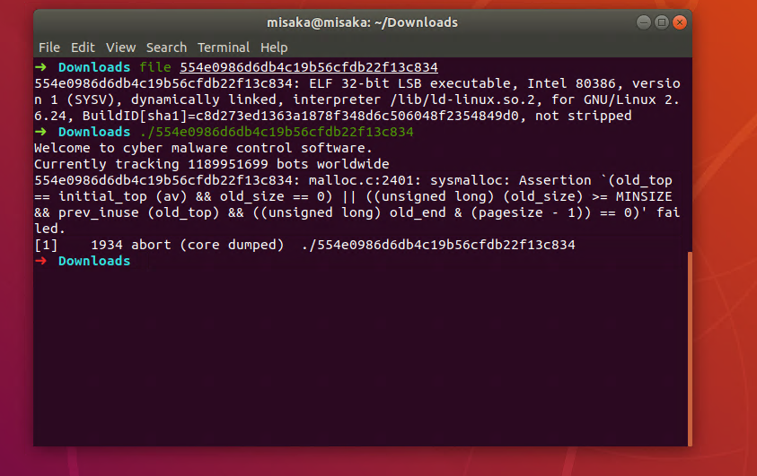

可知这是32位的ELF程序,尝试运行

出现了无法运行的情况,安装`gcc-multilib`

`sudo apt-get install gcc-multilib`



# 静态方法

在IDA中,main函数如下

```cpp
int __cdecl main(int argc, const char **argv, const char **envp)
{
  setlocale(6, &locale);
  banner();
  prompt_authentication();
  authenticate();
  return 0;
}
```

`banner`函数

```cpp
int banner()
{
  unsigned int v0; // eax

  v0 = time(0);
  srand(v0);
  wprintf(&unk_80488B0);//运行时的第一句话
  rand();
  return wprintf(&unk_8048960);//运行时的第二句话
}
```

`prompt_authentication`函数

```cpp
int prompt_authentication()
{
  return wprintf(&unk_80489F8);//提示进行信息输入
}
```

在`authenticate`中,将`s`和`dword_8048A90`传递给了`decrypt`

```cpp
void authenticate()
{
  wchar_t ws[8192]; // [esp+1Ch] [ebp-800Ch]
  wchar_t *s2; // [esp+801Ch] [ebp-Ch]

  s2 = (wchar_t *)decrypt(&s, &dword_8048A90);
  if ( fgetws(ws, 0x2000, stdin) )
  {
    ws[wcslen(ws) - 1] = 0;
    if ( !wcscmp(ws, s2) )
      wprintf(&unk_8048B44);
    else
      wprintf(&unk_8048BA4);
  }
  free(s2);
}
```

`decrypt`函数

```cpp
wchar_t *__cdecl decrypt(wchar_t *s, wchar_t *a2)
{
  size_t v2; // eax
  signed int v4; // [esp+1Ch] [ebp-1Ch]
  signed int i; // [esp+20h] [ebp-18h]
  signed int v6; // [esp+24h] [ebp-14h]
  signed int v7; // [esp+28h] [ebp-10h]
  wchar_t *dest; // [esp+2Ch] [ebp-Ch]

  v6 = wcslen(s);
  v7 = wcslen(a2);
  v2 = wcslen(s);
  dest = (wchar_t *)malloc(v2 + 1);
  wcscpy(dest, s);
  while ( v4 < v6 )
  {
    for ( i = 0; i < v7 && v4 < v6; ++i )//两字符串不断相减,到达尽头后回到起点继续相减,减出来的结果就是flag
      dest[v4++] -= a2[i];
  }
  return dest;
}
```

`s`和`dword_8048A90`


选中数据,用`shift+E`提取数据,选择`C xxx (dec)`


```py
s=[
   58,  20,   0,   0,  54,  20,   0,   0,  55,  20, 
    0,   0,  59,  20,   0,   0, 128,  20,   0,   0, 
  122,  20,   0,   0, 113,  20,   0,   0, 120,  20, 
    0,   0,  99,  20,   0,   0, 102,  20,   0,   0, 
  115,  20,   0,   0, 103,  20,   0,   0,  98,  20, 
    0,   0, 101,  20,   0,   0, 115,  20,   0,   0, 
   96,  20,   0,   0, 107,  20,   0,   0, 113,  20, 
    0,   0, 120,  20,   0,   0, 106,  20,   0,   0, 
  115,  20,   0,   0, 112,  20,   0,   0, 100,  20, 
    0,   0, 120,  20,   0,   0, 110,  20,   0,   0, 
  112,  20,   0,   0, 112,  20,   0,   0, 100,  20, 
    0,   0, 112,  20,   0,   0, 100,  20,   0,   0, 
  110,  20,   0,   0, 123,  20,   0,   0, 118,  20, 
    0,   0, 120,  20,   0,   0, 106,  20,   0,   0, 
  115,  20,   0,   0, 123,  20,   0,   0, 128,  20, 
    0,   0
]
a2=[
  1,  20,   0,   0,   2,  20,   0,   0,   3,  20, 
    0,   0,   4,  20,   0,   0,   5,  20,   0,   0
]
#去除最后多出来的4个零(字符串末尾的'\0')
len_s = len(s)
print(s,a2)
len_a2 = len(a2)
v2 = len(s)
out=[]
v4=0
while v4 < len_s:
    for i in range(len_a2):
        if v4<len_s:
            out.append(s[v4]-a2[i])
            v4+=1
print(out)
for i in out:
    if i>=0:
        print(chr(i),end="")
```

`flag:9447{you_are_an_international_mystery}`

# 动态方法

由IDA分析知,在`decrypt`函数运行结束时会返回flag,在`decrypt`函数结束的地方(`0x08048707`)下断点,并查看寄存器中的内容


在IDA中查看`authenticate`的汇编

```
call    decrypt
mov     [ebp+s2], eax
```

因此flag保存在寄存器eax中


也可以把断点打在`decrypt`函数,然后执行下一步操作

