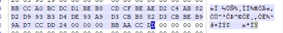
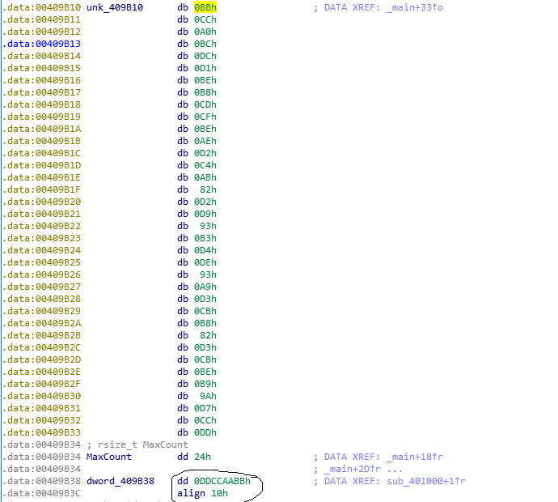
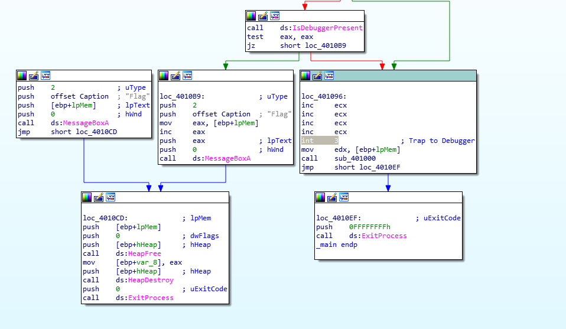

# 静态调试

`main`函数反汇编

```cpp
int __cdecl __noreturn main(int argc, const char **argv, const char **envp)
{
  int v3; // ecx
  CHAR *lpMem; // [esp+8h] [ebp-Ch]
  HANDLE hHeap; // [esp+10h] [ebp-4h]

  hHeap = HeapCreate(0x40000u, 0, 0);
  lpMem = (CHAR *)HeapAlloc(hHeap, 8u, MaxCount + 1);
  memcpy_s(lpMem, MaxCount, &unk_409B10, MaxCount);
  if ( sub_40102A() || IsDebuggerPresent() )
  {
    __debugbreak();
    sub_401000(v3 + 4, lpMem);
    ExitProcess(0xFFFFFFFF);
  }
  MessageBoxA(0, lpMem + 1, "Flag", 2u);
  HeapFree(hHeap, 0, lpMem);
  HeapDestroy(hHeap);
  ExitProcess(0);
}
```

`HeapCreate`:Creates a private heap object that can be used by the calling process. The function reserves space in the virtual address space of the process and allocates physical storage for a specified initial portion of this block.(在进程中创建堆栈)

[https://docs.microsoft.com/zh-cn/windows/win32/api/heapapi/nf-heapapi-heapcreate](https://docs.microsoft.com/zh-cn/windows/win32/api/heapapi/nf-heapapi-heapcreate)

`HeapAlloc`:Allocates a block of memory from a heap. The allocated memory is not movable.(在指定的堆上分配内存)

[https://docs.microsoft.com/en-us/windows/win32/api/heapapi/nf-heapapi-heapalloc](https://docs.microsoft.com/en-us/windows/win32/api/heapapi/nf-heapapi-heapalloc)

`sub_40102A()`是一个永远返回`0`的函数

`IsDebuggerPresent()`:Determines whether the calling process is being debugged by a user-mode debugger.(确定调用进程是否由用户模式的调试器调试,用来反调试)

[https://docs.microsoft.com/en-us/windows/win32/api/debugapi/nf-debugapi-isdebuggerpresent](https://docs.microsoft.com/en-us/windows/win32/api/debugapi/nf-debugapi-isdebuggerpresent)

`MessageBoxA(0, lpMem + 1, "Flag", 2u)`这个函数直接将`lpMem`输出,而`lpMem`中的内容并非ascii,因此造成乱码

正确流程应为进入`if`中的`sub_401000(v3 + 4, lpMem)`函数中,对`lpMem`进行转换,得到正确的flag

`sub_401000(v3 + 4, lpMem)`函数

```cpp
unsigned int __fastcall sub_401000(int a1, int a2)
{
  int v2; // esi
  unsigned int v3; // eax
  unsigned int v4; // ecx
  unsigned int result; // eax

  v2 = dword_409B38;
  v3 = a2 + 1 + strlen((const char *)(a2 + 1)) + 1;
  v4 = 0;
  result = ((v3 - (a2 + 2)) >> 2) + 1;
  if ( result )
  {
    do
      *(_DWORD *)(a2 + 4 * v4++) ^= v2;
    while ( v4 < result );
  }
  return result;
}
```

`lpMem`的内容

```
.data:00409B10 unk_409B10      db 0BBh                 ; DATA XREF: _main+33↑o
.data:00409B11                 db 0CCh
.data:00409B12                 db 0A0h
.data:00409B13                 db 0BCh
.data:00409B14                 db 0DCh
.data:00409B15                 db 0D1h
.data:00409B16                 db 0BEh
.data:00409B17                 db 0B8h
.data:00409B18                 db 0CDh
.data:00409B19                 db 0CFh
.data:00409B1A                 db 0BEh
.data:00409B1B                 db 0AEh
.data:00409B1C                 db 0D2h
.data:00409B1D                 db 0C4h
.data:00409B1E                 db 0ABh
.data:00409B1F                 db  82h
.data:00409B20                 db 0D2h
.data:00409B21                 db 0D9h
.data:00409B22                 db  93h
.data:00409B23                 db 0B3h
.data:00409B24                 db 0D4h
.data:00409B25                 db 0DEh
.data:00409B26                 db  93h
.data:00409B27                 db 0A9h
.data:00409B28                 db 0D3h
.data:00409B29                 db 0CBh
.data:00409B2A                 db 0B8h
.data:00409B2B                 db  82h
.data:00409B2C                 db 0D3h
.data:00409B2D                 db 0CBh
.data:00409B2E                 db 0BEh
.data:00409B2F                 db 0B9h
.data:00409B30                 db  9Ah
.data:00409B31                 db 0D7h
.data:00409B32                 db 0CCh
.data:00409B33                 db 0DDh
```

`dword_409B38`的内容

```
.data:00409B38 dword_409B38    dd 0DDCCAABBh
```

P.S.1:语句`*(_DWORD *)(a2 + 4 * v4++) ^= v2;`说明`a2`中的值为每四个`hex`与`v2`进行一次异或

P.S.2:注意大小端





```py
v2=0xBBAACCDD
a2=[0xBBCCA0BC,0xDCD1BEB8,0xCDCFBEAE,0xD2C4AB82,0xD2D993B3,0xD4DE93A9,0xD3CBB882,0xD3CBBEB9,0x9AD7CCDD]
flag=""
for i in range(9):
    flag+=format((a2[i]^v2),"x")
print(flag)
print(bytearray.fromhex(flag).decode())
```

`flag{reversing_is_not_that_hard!}`

# 动态调试

由于在`if`的条件判断中存在`IsDebuggerPresent()`,这个函数在汇编中添加了`int3`这个断点,因此可以尝试在x32dbg中将`int3`修改为`nop`



