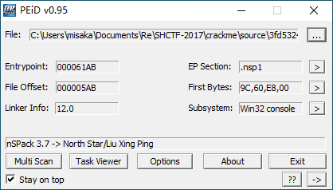
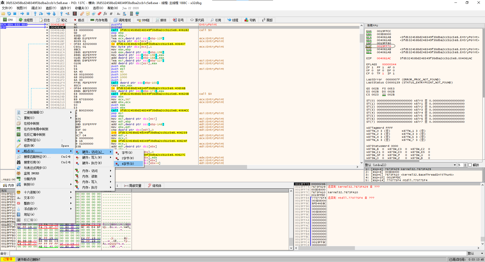
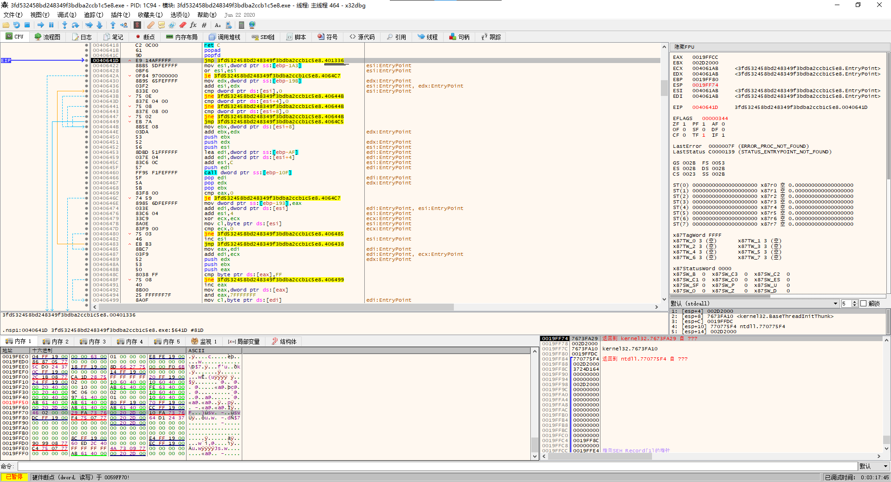
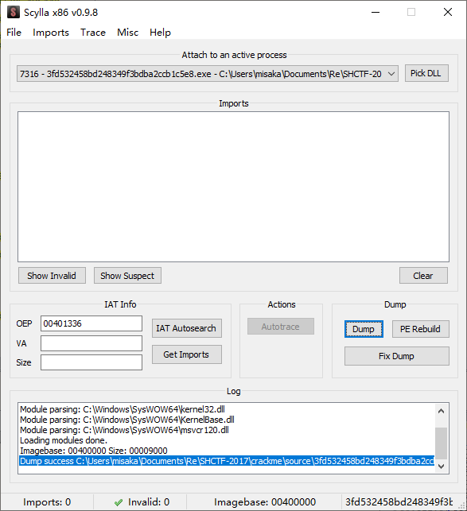
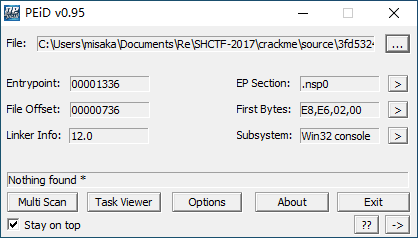
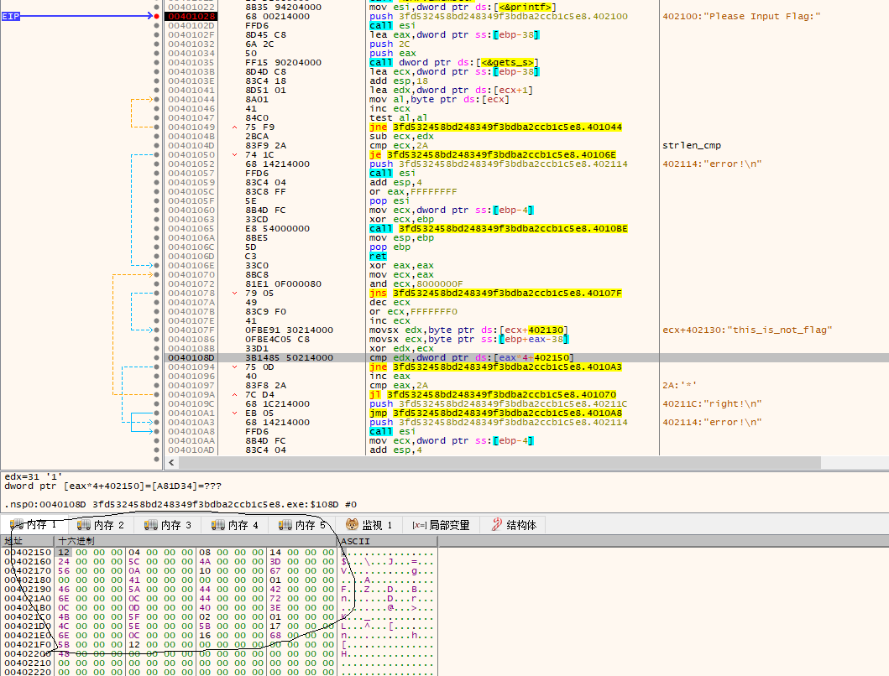

PEiD查壳(北斗3.7)



x32dbg载入,运行到`pushad`,记录ESP地址,在内存窗口中下断点



再次运行,达到`jmp`,可知OEP为`401336`



使用插件中的`Scylla`进行dump



PEiD再次查壳



进行静态分析

main函数(简单的异或)

```cpp
int __cdecl main(int argc, const char **argv, const char **envp)
{
  int result; // eax
  int v4; // eax
  char v5; // [esp+4h] [ebp-38h]
  char v6; // [esp+5h] [ebp-37h]

  v5 = 0;
  sub_4018F4(&v6, 0, 49);
  MEMORY[0x6BF831D1]("Please Input Flag:");
  MEMORY[0x6BF82E80](&v5, 44);
  if ( strlen(&v5) == 42 )
  {
    v4 = 0;
    while ( (*(&v5 + v4) ^ byte_402130[v4 % 16]) == dword_402150[v4] )
    {
      if ( ++v4 >= 42 )
      {
        MEMORY[0x6BF831D1]("right!\n");
        goto LABEL_8;
      }
    }
    MEMORY[0x6BF831D1]("error!\n");
LABEL_8:
    result = 0;
  }
  else
  {
    MEMORY[0x6BF831D1]("error!\n");
    result = -1;
  }
  return result;
}
```

byte_402130为`this_is_not_flag`

dword_402150



```py
a="this_is_not_flag"
b=[18, 4, 8, 20, 36, 92, 74, 61, 86, 10, 16, 103, 0, 65, 0, 1, 70, 90, 68, 66, 110, 12, 68, 114, 12, 13, 64, 62, 75, 95, 2, 1, 76, 94, 91, 23, 110, 12, 22, 104, 91, 18]
for i in range(42):
    print(chr(b[i]^ord(a[i%16])),end="")
```

`flag{59b8ed8f-af22-11e7-bb4a-3cf862d1ee75}`