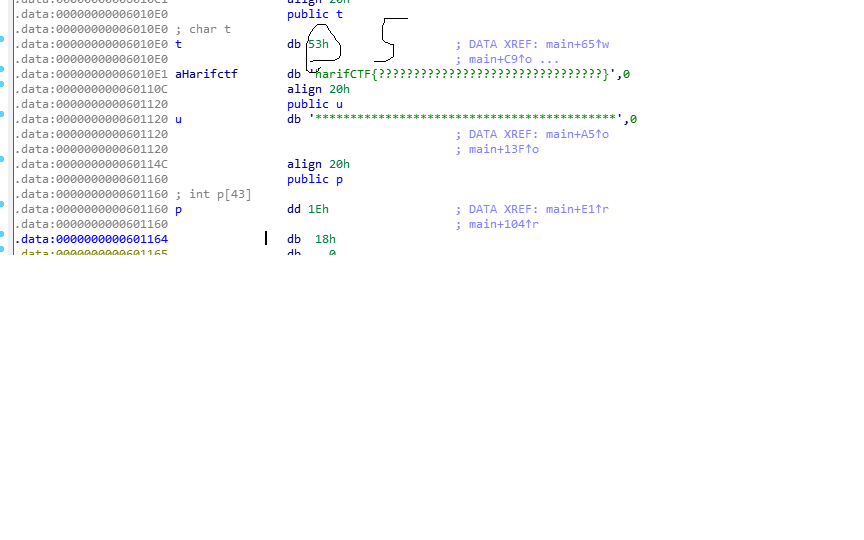
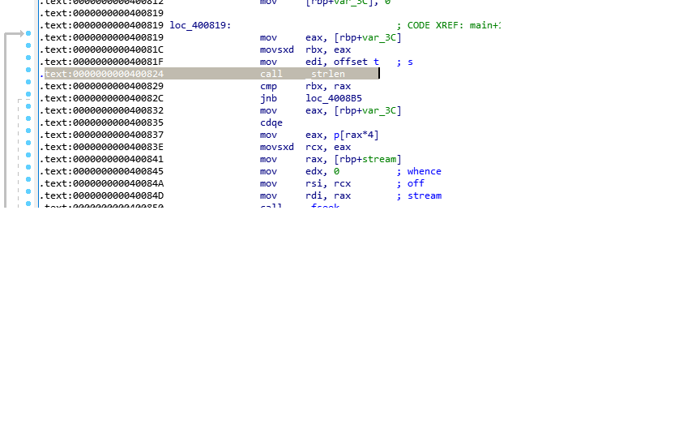
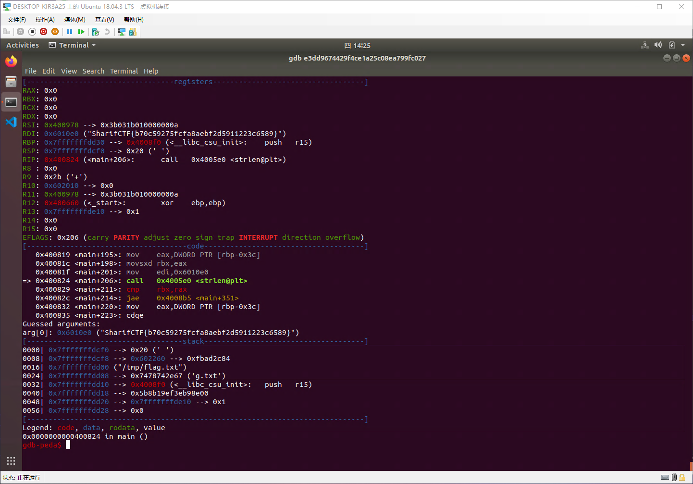

# 静态方法

```cpp
LODWORD(v5) = 0;
  while ( (signed int)v5 < strlen(s) )          // 长度为32
  {
    if ( v5 & 1 )
      v3 = 1;
    else
      v3 = -1;
    *(&t + (signed int)v5 + 10) = s[(signed int)v5] + v3;// s="c61b68366edeb7bdce3c6820314b7498"
    LODWORD(v5) = v5 + 1;
  }
```

把上述代码改写成python,即可得到flag



```py
v5=0
v3=0
s="c61b68366edeb7bdce3c6820314b7498"
while v5<len(s):
    if v5&1:
        v3=1
    else:
        v3=-1
    print(chr(ord(s[v5])+v3),end="")
    v5+=1
print()
a=[24,25,32,40,36,28,17,34,39,16,33,19,26,5,3,29,27,31,4,8,15,37,42,14,41,2,23,21,0,10,20,7,11,1,13,6,38,18,35,12,22,9]
```

flag:`SharifCTF{b70c59275fcfa8aebf2d5911223c6589}`

# 动态方法

在`0x400824`处下断点



