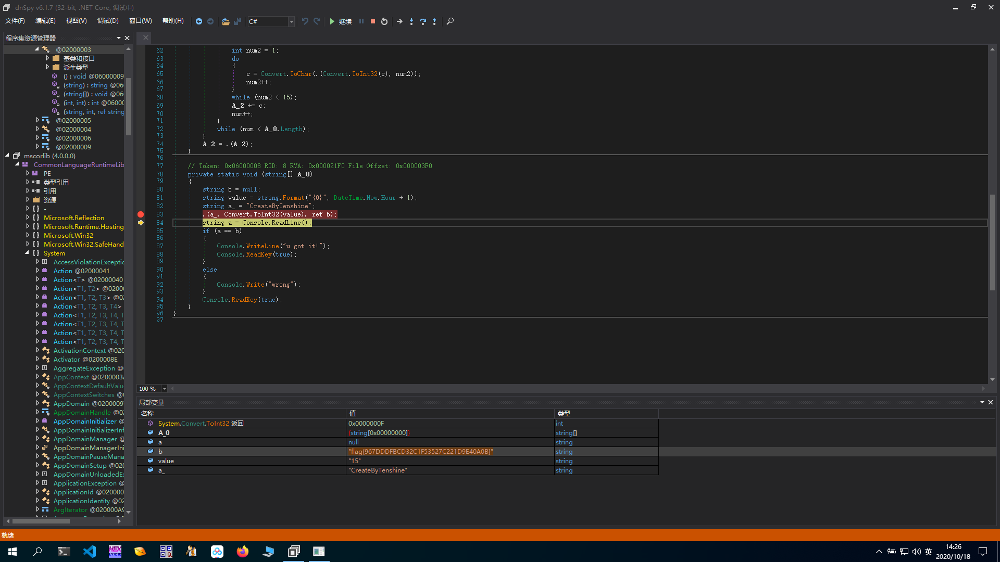

PEID显示为.NET程序

丢进dnspy中查看,得到4个主要函数,分别为

```c#
// ᜅ
// Token: 0x06000007 RID: 7
private static void encodeᜀ(string A_0, int A_1, ref string A_2)
{
	int num = 0;
	if (0 < A_0.Length)
	{
		do
		{
			char c = A_0[num];
			int num2 = 1;
			do
			{
				c = Convert.ToChar(ᜅ.xor(Convert.ToInt32(c), num2));
				num2++;
			}
			while (num2 < 15);
			A_2 += c;
			num++;
		}
		while (num < A_0.Length);
	}
	A_2 = ᜅ.flag_md5ᜀ(A_2);
}
```

```c#
// ᜅ
// Token: 0x06000006 RID: 6
private static string flag_md5ᜀ(string A_0)
{
	byte[] bytes = Encoding.ASCII.GetBytes(A_0);
	return "flag{" + BitConverter.ToString(new MD5CryptoServiceProvider().ComputeHash(bytes)).Replace("-", "") + "}";
}
```

```c#
// ᜅ
// Token: 0x06000008 RID: 8
private static void maybe_mainᜀ(string[] A_0)
{
	string b = null;
	string value = string.Format("{0}", DateTime.Now.Hour + 1);
	string a_ = "CreateByTenshine";
	ᜅ.encodeᜀ(a_, Convert.ToInt32(value), ref b);
	string a = Console.ReadLine();
	if (a == b)
	{
		Console.WriteLine("u got it!");
		Console.ReadKey(true);
	}
	else
	{
		Console.Write("wrong");
	}
	Console.ReadKey(true);
}
```

```c#
// ᜅ
// Token: 0x06000005 RID: 5
private static int xor(int A_0, int A_1)
{
	return (new int[]
	{
		2,
		3,
		5,
		7,
		11,
		13,
		17,
		19,
		23,
		29,
		31,
		37,
		41,
		43,
		47,
		53,
		59,
		61,
		67,
		71,
		73,
		79,
		83,
		89,
		97,
		101,
		103,
		107,
		109,
		113
	})[A_1] ^ A_0;
}
```

在`ᜅ.encodeᜀ(a_, Convert.ToInt32(value), ref b);`处下断点进行调试,可以直接得到flag



```py
import hashlib
a=[2, 3, 5, 7, 11, 13, 17, 19, 23, 29, 31, 37, 41, 43, 47, 53, 59, 61, 67, 71, 73, 79, 83, 89, 97, 101, 103, 107, 109, 113]
b="CreateByTenshine"
flag=""
for i in b:
    ch=i
    for j in range(1,15):
        ch=chr(ord(ch)^a[j])
    flag+=ch
flag=hashlib.md5(flag.encode("utf-8"))
print("flag{"+flag.hexdigest().upper()+"}")#提交的flag要大写....
```