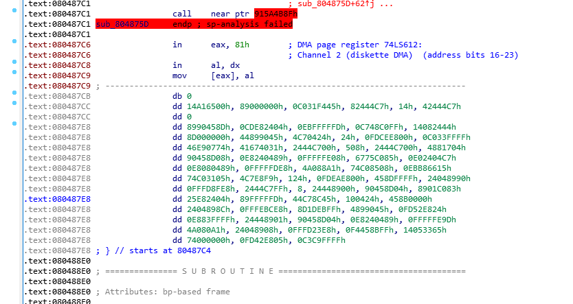
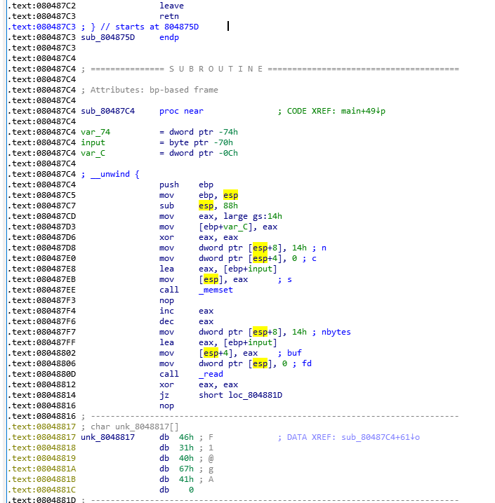
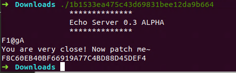

错误如图所示,将整段代码Undefine,重新生成,将部分`jmp`修改成`nop`



main函数

```cpp
int __cdecl main()
{
  setbuf(stdin, 0);
  setbuf(stdout, 0);
  dword_804A088 = 1;
  puts("               **************\n               Echo Server 0.3 ALPHA\n               **************");
  sub_80487C4();
  return 0;
}
```

```cpp
unsigned int sub_80487C4()
{
  size_t v0; // eax
  unsigned __int8 *v1; // ST14_4
  size_t v2; // eax
  char input; // [esp+18h] [ebp-70h]
  _BYTE v5[3]; // [esp+19h] [ebp-6Fh]
  unsigned int v6; // [esp+7Ch] [ebp-Ch]

  v6 = __readgsdword(0x14u);
  memset(&input, 0, 0x14u);
  read(0, &input, 0x14u);
  if ( !strncmp(&input, unk_8048817, 5u) )
  {
    puts("You are very close! Now patch me~");
    if ( dword_804A088 )
      exit(1);
    v0 = strlen(&input);
    v1 = MD5(v5, v0, 0);
    sub_804875D(v1, 16u);
  }
  else
  {
    v2 = strlen(&input);
    sub_804875D(&input, v2 - 1);
  }
  fflush(stdout);
  return __readgsdword(0x14u) ^ v6;
}
```

```
.text:08048817 ; char unk_8048817[]
.text:08048817 unk_8048817     db  46h ; F             ; DATA XREF: sub_80487C4+61↓o
.text:08048818                 db  31h ; 1
.text:08048819                 db  40h ; @
.text:0804881A                 db  67h ; g
.text:0804881B                 db  41h ; A
.text:0804881C                 db    0
```

在Linux下无法直接运行

`sudo dpkg --add-architecture i386`启用i386架构

`sudo apt update && sudo apt upgrade -y && sudo apt autoremove -y`进行刷新

`sudo apt-get install libssl1.0.0:i386`添加运行库

```cpp
if ( dword_804A088 )
      exit(1);
```

在main函数中,`dword_804A088`被设置成`1`,手动将其patch成`0`,或者将`jz      short loc_8048866`patch成`jnz      short loc_8048866`

运行,并输入`F1@gA`,得到flag

