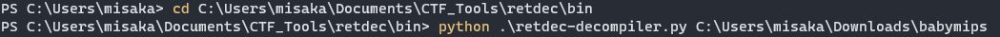

# mips逆向

利用[retdec](https://github.com/avast/retdec)进行反编译(并不准确,需要结合汇编来看)



`python .\retdec-decompiler.py C:\Users\misaka\Downloads\babymips`

得到`c`文件,内容为反编译代码

关键函数为

```cpp
int32_t function_4009a8(void) {
    // 0x4009a8
    setbuf(g6, NULL);
    setbuf(g7, NULL);
    printf("Give me your flag:");
    int32_t str; // bp-44, 0x4009a8
    scanf("%32s", &str);
    int32_t v1 = 0;
    int32_t v2 = 0; // 0x400a70
    char * v3 = (char *)((int32_t)&v1 + 4 + v2); // 0x400a28
    *v3 = (char)((0x1000000 * (int32_t)*v3 ^ 0x20000000 - 0x1000000 * v2) / 0x1000000);
    v2 = v1 + 1;
    v1 = v2;
    while (v2 < 32) {
        // 0x400a1c
        v3 = (char *)((int32_t)&v1 + 4 + v2);
        *v3 = (char)((0x1000000 * (int32_t)*v3 ^ 0x20000000 - 0x1000000 * v2) / 0x1000000);
        v2 = v1 + 1;
        v1 = v2;
    }
    // 0x400a8c
    int32_t puts_rc; // 0x4009a8
    if (strncmp((char *)&str, g8, 5) == 0) {
        // 0x400ab4
        puts_rc = function_4007f0(&str);
    } else {
        // 0x400acc
        puts_rc = puts("Wrong");
    }
    // 0x400adc
    return puts_rc;
}
```

```cpp
int32_t function_4007f0(int32_t * str) {
    int32_t v1 = (int32_t)str;
    int32_t v2 = 5; // 0x400930
    if (strlen((char *)str) > 5) {
        char * v3 = (char *)(v2 + v1);
        unsigned char v4 = *v3;
        char v5; // 0x4007f0
        if (v2 % 2 == 0) {
            // 0x400898
            v5 = (0x1000000 * (int32_t)(v4 / 64) | 0x4000000 * (int32_t)v4) / 0x1000000;
        } else {
            // 0x400828
            v5 = (0x1000000 * (int32_t)(v4 / 4) | 0x40000000 * (int32_t)v4) / 0x1000000;
        }
        // 0x400900
        *v3 = v5;
        v2++;
        while (v2 < strlen((char *)str)) {
            // 0x400814
            v3 = (char *)(v2 + v1);
            v4 = *v3;
            if (v2 % 2 == 0) {
                // 0x400898
                v5 = (0x1000000 * (int32_t)(v4 / 64) | 0x4000000 * (int32_t)v4) / 0x1000000;
            } else {
                // 0x400828
                v5 = (0x1000000 * (int32_t)(v4 / 4) | 0x40000000 * (int32_t)v4) / 0x1000000;
            }
            // 0x400900
            *v3 = v5;
            v2++;
        }
    }
    // 0x400934
    int32_t puts_rc; // 0x4007f0
    if (strncmp((char *)(v1 + 5), (char *)g9, 27) == 0) {
        // 0x400964
        puts_rc = puts("Right!");
    } else {
        // 0x40097c
        puts_rc = puts("Wrong!");
    }
    // 0x40098c
    return puts_rc;
}
```

可知信息:

1. 输入的flag的长度为32

2. 对输入的flag进行某种异或操作后,前五个字符要与`Q|j{g`相同

3. 剩下的字符进行位移操作和与操作后,得到的字符数组要与`0x52, 0xFD, 0x16, 0xA4, 0x89, 0xBD, 0x92, 0x80, 0x13, 0x41, 0x54, 0xA0, 0x8D, 0x45, 0x18, 0x81, 0xDE, 0xFC, 0x95, 0xF0, 0x16, 0x79, 0x1A, 0x15, 0x5B, 0x75, 0x1F`相同

然后从汇编得到更详细的信息

```s
.text:00400A1C loc_400A1C:                              # CODE XREF: sub_4009A8+DC↓j
.text:00400A1C                 lw      $v0, 0x48+var_30($fp)
.text:00400A20                 addiu   $v1, $fp, 0x48+var_30  # v1为字符数组中的each_char
.text:00400A24                 addu    $v0, $v1, $v0
.text:00400A28                 lb      $v1, 4($v0)
.text:00400A2C                 lw      $v0, 0x48+var_30($fp)
.text:00400A30                 nop
.text:00400A34                 andi    $v0, 0xFF
.text:00400A38                 li      $a0, 32
.text:00400A3C                 subu    $v0, $a0, $v0    # v0=32-v0
.text:00400A40                 andi    $v0, 0xFF
.text:00400A44                 sll     $v0, 24
.text:00400A48                 sra     $v0, 24
.text:00400A4C                 xor     $v0, $v1, $v0
.text:00400A50                 sll     $v1, $v0, 24
.text:00400A54                 sra     $v1, 24
.text:00400A58                 lw      $v0, 0x48+var_30($fp)
.text:00400A5C                 addiu   $a0, $fp, 0x48+var_30
.text:00400A60                 addu    $v0, $a0, $v0
.text:00400A64                 sb      $v1, 4($v0)
.text:00400A68                 lw      $v0, 0x48+var_30($fp)
.text:00400A6C                 nop
.text:00400A70                 addiu   $v0, 1
.text:00400A74                 sw      $v0, 0x48+var_30($fp)
.text:00400A78
.text:00400A78 loc_400A78:                              # CODE XREF: sub_4009A8+6C↑j
.text:00400A78                 lw      $v0, 0x48+var_30($fp)
.text:00400A7C                 nop
.text:00400A80                 slti    $v0, 32          # 猜测v0为数组下标
.text:00400A84                 bnez    $v0, loc_400A1C
```

```s
.text:004007F0 sub_4007F0:                              # CODE XREF: sub_4009A8+114↓p
.text:004007F0
.text:004007F0 var_10          = -0x10
.text:004007F0 var_8           = -8
.text:004007F0 var_4           = -4
.text:004007F0 arg_0           =  0
.text:004007F0
.text:004007F0                 addiu   $sp, -0x28       # Add Immediate Unsigned
.text:004007F4                 sw      $ra, 0x28+var_4($sp)  # Store Word
.text:004007F8                 sw      $fp, 0x28+var_8($sp)  # Store Word
.text:004007FC                 move    $fp, $sp
.text:00400800                 sw      $a0, 0x28+arg_0($fp)  # Store Word
.text:00400804                 li      $v0, 5           # Load Immediate
.text:00400808                 sw      $v0, 0x28+var_10($fp)  # Store Word
.text:0040080C                 b       loc_400910       # Branch Always
.text:00400810                 nop
.text:00400814  # ---------------------------------------------------------------------------
.text:00400814
.text:00400814 loc_400814:                              # CODE XREF: sub_4007F0+13C↓j
.text:00400814                 lw      $v0, 0x28+var_10($fp)  # v0为下标
.text:00400818                 nop
.text:0040081C                 andi    $v0, 1           # v0%2
.text:00400820                 beqz    $v0, loc_400898  # v0%2==0
.text:00400824                 nop                      # v0%2==1
.text:00400828                 lw      $v0, 0x28+var_10($fp)  # v0=str[v0]
.text:0040082C                 lw      $v1, 0x28+arg_0($fp)  # Load Word
.text:00400830                 nop
.text:00400834                 addu    $v0, $v1, $v0    # Add Unsigned
.text:00400838                 lb      $v0, 0($v0)      # Load Byte
.text:0040083C                 nop
.text:00400840                 sra     $v0, 2           # v0>>2
.text:00400844                 sll     $a0, $v0, 24     # Shift Left Logical
.text:00400848                 sra     $a0, 24          # Shift Right Arithmetic
.text:0040084C                 lw      $v0, 0x28+var_10($fp)  # Load Word
.text:00400850                 lw      $v1, 0x28+arg_0($fp)  # Load Word
.text:00400854                 nop
.text:00400858                 addu    $v0, $v1, $v0    # Add Unsigned
.text:0040085C                 lb      $v0, 0($v0)      # Load Byte
.text:00400860                 nop
.text:00400864                 sll     $v0, 6           # v0<<6
.text:00400868                 sll     $v1, $v0, 24     # Shift Left Logical
.text:0040086C                 sra     $v1, 24          # Shift Right Arithmetic
.text:00400870                 lw      $v0, 0x28+var_10($fp)  # Load Word
.text:00400874                 lw      $a1, 0x28+arg_0($fp)  # Load Word
.text:00400878                 nop
.text:0040087C                 addu    $v0, $a1, $v0    # Add Unsigned
.text:00400880                 or      $v1, $a0, $v1    # (v0>>2)|(v0<<6)
.text:00400884                 sll     $v1, 24          # Shift Left Logical
.text:00400888                 sra     $v1, 24          # Shift Right Arithmetic
.text:0040088C                 sb      $v1, 0($v0)      # Store Byte
.text:00400890                 b       loc_400900       # Branch Always
.text:00400894                 nop
.text:00400898  # ---------------------------------------------------------------------------
.text:00400898
.text:00400898 loc_400898:                              # CODE XREF: sub_4007F0+30↑j
.text:00400898                 lw      $v0, 0x28+var_10($fp)  # v0%2==0
.text:0040089C                 lw      $v1, 0x28+arg_0($fp)  # Load Word
.text:004008A0                 nop
.text:004008A4                 addu    $v0, $v1, $v0    # Add Unsigned
.text:004008A8                 lb      $v0, 0($v0)      # Load Byte
.text:004008AC                 nop
.text:004008B0                 sll     $v0, 2           # v0<<2
.text:004008B4                 sll     $a0, $v0, 24     # Shift Left Logical
.text:004008B8                 sra     $a0, 24          # Shift Right Arithmetic
.text:004008BC                 lw      $v0, 0x28+var_10($fp)  # Load Word
.text:004008C0                 lw      $v1, 0x28+arg_0($fp)  # Load Word
.text:004008C4                 nop
.text:004008C8                 addu    $v0, $v1, $v0    # Add Unsigned
.text:004008CC                 lb      $v0, 0($v0)      # Load Byte
.text:004008D0                 nop
.text:004008D4                 sra     $v0, 6           # v0>>6
.text:004008D8                 sll     $v1, $v0, 24     # Shift Left Logical
.text:004008DC                 sra     $v1, 24          # Shift Right Arithmetic
.text:004008E0                 lw      $v0, 0x28+var_10($fp)  # Load Word
.text:004008E4                 lw      $a1, 0x28+arg_0($fp)  # Load Word
.text:004008E8                 nop
.text:004008EC                 addu    $v0, $a1, $v0    # Add Unsigned
.text:004008F0                 or      $v1, $a0, $v1    # (v0>>6)|(v0<<2)
.text:004008F4                 sll     $v1, 24          # Shift Left Logical
.text:004008F8                 sra     $v1, 24          # Shift Right Arithmetic
.text:004008FC                 sb      $v1, 0($v0)      # Store Byte
.text:00400900
.text:00400900 loc_400900:                              # CODE XREF: sub_4007F0+A0↑j
.text:00400900                 lw      $v0, 0x28+var_10($fp)  # Load Word
.text:00400904                 nop
.text:00400908                 addiu   $v0, 1           # Add Immediate Unsigned
.text:0040090C                 sw      $v0, 0x28+var_10($fp)  # Store Word
.text:00400910
.text:00400910 loc_400910:                              # CODE XREF: sub_4007F0+1C↑j
.text:00400910                 lw      $a0, 0x28+arg_0($fp)  # s
.text:00400914                 jal     strlen           # Jump And Link
.text:00400918                 nop
.text:0040091C                 move    $v1, $v0
.text:00400920                 lw      $v0, 0x28+var_10($fp)  # Load Word
.text:00400924                 nop
.text:00400928                 sltu    $v0, $v1         # Set on Less Than Unsigned
.text:0040092C                 bnez    $v0, loc_400814  # v0为下标
.text:00400930                 nop
.text:00400934                 lw      $v0, 0x28+arg_0($fp)  # Load Word
.text:00400938                 nop
.text:0040093C                 addiu   $v1, $v0, 5      # Add Immediate Unsigned
.text:00400940                 lw      $v0, off_410D04  # Load Word
.text:00400948                 li      $a2, 0x1B        # n
.text:0040094C                 move    $a1, $v0         # s2
.text:00400950                 move    $a0, $v1         # s1
.text:00400954                 jal     strncmp          # Jump And Link
.text:00400958                 nop
.text:0040095C                 bnez    $v0, loc_40097C  # Branch on Not Zero
.text:00400960                 nop
.text:00400964                 lui     $v0, 0x40        # Load Upper Immediate
.text:00400968                 addiu   $a0, $v0, (aRight - 0x400000)  # "Right!"
.text:0040096C                 jal     puts             # Jump And Link
.text:00400970                 nop
.text:00400974                 b       loc_40098C       # Branch Always
.text:00400978                 nop
.text:0040097C  # ---------------------------------------------------------------------------
.text:0040097C
.text:0040097C loc_40097C:                              # CODE XREF: sub_4007F0+16C↑j
.text:0040097C                 lui     $v0, 0x40        # Load Upper Immediate
.text:00400980                 addiu   $a0, $v0, (aWrong - 0x400000)  # "Wrong!"
.text:00400984                 jal     puts             # Jump And Link
.text:00400988                 nop
.text:0040098C
.text:0040098C loc_40098C:                              # CODE XREF: sub_4007F0+184↑j
.text:0040098C                 nop
.text:00400990                 move    $sp, $fp
.text:00400994                 lw      $ra, 0x28+var_4($sp)  # Load Word
.text:00400998                 lw      $fp, 0x28+var_8($sp)  # Load Word
.text:0040099C                 addiu   $sp, 0x28        # Add Immediate Unsigned
.text:004009A0                 jr      $ra              # Jump Register
.text:004009A4                 nop
.text:004009A4  # End of function sub_4007F0
```

可得exp

```python
data=[81, 124, 106, 123, 103, 82, 253, 22, 164, 137, 189, 146, 128, 19, 65, 84, 160, 141, 69, 24, 129, 222, 252, 149, 240, 22, 121, 26, 21, 91, 117, 31]
for i in range(5,32):
        if i%2==0:
            for j in range(256):
                v5=(j>>6)|(j<<2)
                v5=v5&0xff
                if v5==data[i]:
                    data[i]=j
                    break
        else:
            for j in range(256):
                v5=(j>>2)|(j<<6)
                v5=v5&0xff
                if v5==data[i]:
                    data[i]=j
                    break
print(data)
for i in range(32):
    print(chr(data[i]^(32-i)),end="")
```

```
[81, 124, 106, 123, 103, 73, 127, 88, 41, 38, 111, 74, 32, 76, 80, 81, 40, 54, 81, 96, 96, 123, 63, 86, 60, 88, 94, 104, 69, 109, 93, 124]
qctf{ReA11y_4_B@89_mlp5_4_XmAn_} 
```