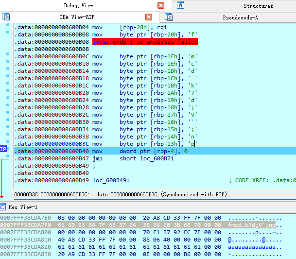
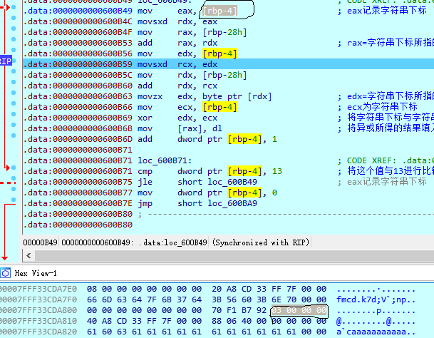

# 动态分析

main函数

```cpp
int __cdecl main(int argc, const char **argv, const char **envp)
{
  char s; // [rsp+0h] [rbp-20h]
  int v5; // [rsp+18h] [rbp-8h]
  int i; // [rsp+1Ch] [rbp-4h]

  for ( i = 0; i <= 181; ++i )
  {
    envp = (const char **)(*((unsigned __int8 *)judge + i) ^ 0xCu);
    *((_BYTE *)judge + i) ^= 0xCu;
  }
  printf("Please input flag:", argv, envp);
  __isoc99_scanf("%20s", &s);
  v5 = strlen(&s);
  if ( v5 == 14 && (unsigned int)judge(&s) )
    puts("Right!");
  else
    puts("Wrong!");
  return 0;
}
```

尝试进入`judge`函数

```
Decompilation failure:
600B01: positive sp value has been found

Please refer to the manual to find appropriate actions
```

judge汇编

```
.data:0000000000600B00                 public judge
.data:0000000000600B00 judge           proc far                ; CODE XREF: main+80↑p
.data:0000000000600B00                                         ; DATA XREF: main+16↑r ...
.data:0000000000600B00                 pop     rcx
.data:0000000000600B01                 test    ecx, r13d
.data:0000000000600B04                 test    [rcx-2Ch], r14d
.data:0000000000600B08                 retf    0EC49h
.data:0000000000600B08 judge           endp ; sp-analysis failed
.data:0000000000600B08
.data:0000000000600B08 ; ---------------------------------------------------------------------------
.data:0000000000600B0B                 db  6Ah ; j
.data:0000000000600B0C                 db 0CAh
.data:0000000000600B0D                 db  49h ; I
.data:0000000000600B0E                 db 0EDh
.data:0000000000600B0F                 db  61h ; a
.data:0000000000600B10                 db 0CAh
.data:0000000000600B11                 db  49h ; I
.data:0000000000600B12                 db 0EEh
.data:0000000000600B13                 db  6Fh ; o
.data:0000000000600B14                 db 0CAh
.data:0000000000600B15                 db  49h ; I
.data:0000000000600B16                 db 0EFh
.data:0000000000600B17                 db  68h ; h
.data:0000000000600B18                 db 0CAh
.data:0000000000600B19                 db  49h ; I
.data:0000000000600B1A                 db 0E8h
.data:0000000000600B1B                 db  73h ; s
.data:0000000000600B1C                 db 0CAh
.data:0000000000600B1D                 db  49h ; I
.data:0000000000600B1E                 db 0E9h
.data:0000000000600B1F                 db  67h ; g
.data:0000000000600B20                 db 0CAh
.data:0000000000600B21                 db  49h ; I
.data:0000000000600B22                 db 0EAh
.data:0000000000600B23                 db  3Bh ; ;
.data:0000000000600B24                 db 0CAh
.data:0000000000600B25                 db  49h ; I
.data:0000000000600B26                 db 0EBh
.data:0000000000600B27                 db  68h ; h
.data:0000000000600B28                 db 0CAh
.data:0000000000600B29                 db  49h ; I
.data:0000000000600B2A                 db 0E4h
.data:0000000000600B2B                 db  37h ; 7
.data:0000000000600B2C                 db 0CAh
.data:0000000000600B2D                 db  49h ; I
.data:0000000000600B2E                 db 0E5h
.data:0000000000600B2F                 db  5Ah ; Z
.data:0000000000600B30                 db 0CAh
.data:0000000000600B31                 db  49h ; I
.data:0000000000600B32                 db 0E6h
.data:0000000000600B33                 db  6Ch ; l
.data:0000000000600B34                 db 0CAh
.data:0000000000600B35                 db  49h ; I
.data:0000000000600B36                 db 0E7h
.data:0000000000600B37                 db  37h ; 7
.data:0000000000600B38                 db 0CAh
.data:0000000000600B39                 db  49h ; I
.data:0000000000600B3A                 db 0E0h
.data:0000000000600B3B                 db  62h ; b
.data:0000000000600B3C                 db 0CAh
.data:0000000000600B3D                 db  49h ; I
.data:0000000000600B3E                 db 0E1h
.data:0000000000600B3F                 db  7Ch ; |
.data:0000000000600B40                 db 0CBh
.data:0000000000600B41                 db  49h ; I
.data:0000000000600B42                 db 0F0h
.data:0000000000600B43                 db  0Ch
.data:0000000000600B44                 db  0Ch
.data:0000000000600B45                 db  0Ch
.data:0000000000600B46                 db  0Ch
.data:0000000000600B47                 db 0E7h
.data:0000000000600B48                 db  24h ; $
.data:0000000000600B49                 db  87h
.data:0000000000600B4A                 db  49h ; I
.data:0000000000600B4B                 db 0F0h
.data:0000000000600B4C                 db  44h ; D
.data:0000000000600B4D                 db  6Fh ; o
.data:0000000000600B4E                 db 0DCh
.data:0000000000600B4F                 db  44h ; D
.data:0000000000600B50                 db  87h
.data:0000000000600B51                 db  49h ; I
.data:0000000000600B52                 db 0D4h
.data:0000000000600B53                 db  44h ; D
.data:0000000000600B54                 db  0Dh
.data:0000000000600B55                 db 0DCh
.data:0000000000600B56                 db  87h
.data:0000000000600B57                 db  59h ; Y
.data:0000000000600B58                 db 0F0h
.data:0000000000600B59                 db  44h ; D
.data:0000000000600B5A                 db  6Fh ; o
.data:0000000000600B5B                 db 0C6h
.data:0000000000600B5C                 db  44h ; D
.data:0000000000600B5D                 db  87h
.data:0000000000600B5E                 db  59h ; Y
.data:0000000000600B5F                 db 0D4h
.data:0000000000600B60                 db  44h ; D
.data:0000000000600B61                 db  0Dh
.data:0000000000600B62                 db 0C6h
.data:0000000000600B63                 db    3
.data:0000000000600B64                 db 0BAh
.data:0000000000600B65                 db  1Eh
.data:0000000000600B66                 db  87h
.data:0000000000600B67                 db  41h ; A
.data:0000000000600B68                 db 0F0h
.data:0000000000600B69                 db  3Dh ; =
.data:0000000000600B6A                 db 0C6h
.data:0000000000600B6B                 db  84h
.data:0000000000600B6C                 db  1Ch
.data:0000000000600B6D                 db  8Fh
.data:0000000000600B6E                 db  49h ; I
.data:0000000000600B6F                 db 0F0h
.data:0000000000600B70                 db  0Dh
.data:0000000000600B71                 db  8Fh
.data:0000000000600B72                 db  71h ; q
.data:0000000000600B73                 db 0F0h
.data:0000000000600B74                 db    1
.data:0000000000600B75                 db  72h ; r
.data:0000000000600B76                 db 0DEh
.data:0000000000600B77                 db 0CBh
.data:0000000000600B78                 db  49h ; I
.data:0000000000600B79                 db 0F0h
.data:0000000000600B7A                 db  0Ch
.data:0000000000600B7B                 db  0Ch
.data:0000000000600B7C                 db  0Ch
.data:0000000000600B7D                 db  0Ch
.data:0000000000600B7E                 db 0E7h
.data:0000000000600B7F                 db  25h ; %
.data:0000000000600B80                 db  87h
.data:0000000000600B81                 db  49h ; I
.data:0000000000600B82                 db 0F0h
.data:0000000000600B83                 db  44h ; D
.data:0000000000600B84                 db  6Fh ; o
.data:0000000000600B85                 db 0DCh
.data:0000000000600B86                 db  44h ; D
.data:0000000000600B87                 db  87h
.data:0000000000600B88                 db  49h ; I
.data:0000000000600B89                 db 0D4h
.data:0000000000600B8A                 db  44h ; D
.data:0000000000600B8B                 db  0Dh
.data:0000000000600B8C                 db 0DCh
.data:0000000000600B8D                 db    3
.data:0000000000600B8E                 db 0BAh
.data:0000000000600B8F                 db  1Ch
.data:0000000000600B90                 db  87h
.data:0000000000600B91                 db  49h ; I
.data:0000000000600B92                 db 0F0h
.data:0000000000600B93                 db  44h ; D
.data:0000000000600B94                 db  94h
.data:0000000000600B95                 db    3
.data:0000000000600B96                 db 0BAh
.data:0000000000600B97                 db  48h ; H
.data:0000000000600B98                 db    9
.data:0000000000600B99                 db 0ECh
.data:0000000000600B9A                 db  34h ; 4
.data:0000000000600B9B                 db 0CEh
.data:0000000000600B9C                 db  78h ; x
.data:0000000000600B9D                 db  0Bh
.data:0000000000600B9E                 db 0B4h
.data:0000000000600B9F                 db  0Ch
.data:0000000000600BA0                 db  0Ch
.data:0000000000600BA1                 db  0Ch
.data:0000000000600BA2                 db  0Ch
.data:0000000000600BA3                 db 0E7h
.data:0000000000600BA4                 db    3
.data:0000000000600BA5                 db  8Fh
.data:0000000000600BA6                 db  49h ; I
.data:0000000000600BA7                 db 0F0h
.data:0000000000600BA8                 db  0Dh
.data:0000000000600BA9                 db  8Fh
.data:0000000000600BAA                 db  71h ; q
.data:0000000000600BAB                 db 0F0h
.data:0000000000600BAC                 db    1
.data:0000000000600BAD                 db  72h ; r
.data:0000000000600BAE                 db 0DDh
.data:0000000000600BAF                 db 0B4h
.data:0000000000600BB0                 db  0Dh
.data:0000000000600BB1                 db  0Ch
.data:0000000000600BB2                 db  0Ch
.data:0000000000600BB3                 db  0Ch
.data:0000000000600BB4                 db  51h ; Q
.data:0000000000600BB5                 db 0CFh
.data:0000000000600BB5 _data           ends
```

在`if ( v5 == 14 && (unsigned int)judge(&s) )`处下断点进行动态调试

```
.data:0000000000600B08 mov     byte ptr [rbp-20h], 66h
.data:0000000000600B08 judge endp ; sp-analysis failed
.data:0000000000600B08
.data:0000000000600B0C mov     byte ptr [rbp-1Fh], 6Dh
.data:0000000000600B10 mov     byte ptr [rbp-1Eh], 63h
.data:0000000000600B14 mov     byte ptr [rbp-1Dh], 64h
.data:0000000000600B18 mov     byte ptr [rbp-1Ch], 7Fh
.data:0000000000600B1C mov     byte ptr [rbp-1Bh], 6Bh
.data:0000000000600B20 mov     byte ptr [rbp-1Ah], 37h
.data:0000000000600B24 mov     byte ptr [rbp-19h], 64h
.data:0000000000600B28 mov     byte ptr [rbp-18h], 3Bh
.data:0000000000600B2C mov     byte ptr [rbp-17h], 56h
.data:0000000000600B30 mov     byte ptr [rbp-16h], 60h
.data:0000000000600B34 mov     byte ptr [rbp-15h], 3Bh
.data:0000000000600B38 mov     byte ptr [rbp-14h], 6Eh
.data:0000000000600B3C mov     byte ptr [rbp-13h], 70h
```

向栈中填入数值



loc_600B49

```
.data:0000000000600B40 mov     dword ptr [rbp-4], 0            ; 初始化某个值为0
.data:0000000000600B47 jmp     short loc_600B71                ; 将这个值与13进行比较,回跳到loc_600B49,猜测该值为输入的字符串的长度[0,13],在loc_600B49中对字符串逐个字符处理,因此可以推断[rbp-4]存储了字符串下标
.data:0000000000600B49 ; ---------------------------------------------------------------------------
.data:0000000000600B49
.data:0000000000600B49 loc_600B49:                             ; CODE XREF: .data:0000000000600B75↓j
.data:0000000000600B49 mov     eax, [rbp-4]                    ; eax记录字符串下标
.data:0000000000600B4C movsxd  rdx, eax
.data:0000000000600B4F mov     rax, [rbp-28h]
.data:0000000000600B53 add     rax, rdx                        ; rax=字符串下标所指的地址
.data:0000000000600B56 mov     edx, [rbp-4]
.data:0000000000600B59 movsxd  rcx, edx
.data:0000000000600B5C mov     rdx, [rbp-28h]
.data:0000000000600B60 add     rdx, rcx
.data:0000000000600B63 movzx   edx, byte ptr [rdx]             ; edx=字符串下标所指的值
.data:0000000000600B66 mov     ecx, [rbp-4]                    ; ecx为字符串下标
.data:0000000000600B69 xor     edx, ecx                        ; 将字符串下标与字符串下标所指的值进行异或
.data:0000000000600B6B mov     [rax], dl                       ; 将异或所得的结果填入字符串下标的位置
.data:0000000000600B6D add     dword ptr [rbp-4], 1
.data:0000000000600B71
.data:0000000000600B71 loc_600B71:                             ; CODE XREF: .data:0000000000600B47↑j
.data:0000000000600B71 cmp     dword ptr [rbp-4], 13           ; 将这个值与13进行比较,回跳到loc_600B49,猜测该值为输入的字符串的长度[0,13],在loc_600B49中对字符串逐个字符处理,因此可以推断[rbp-4]存储了字符串下标
.data:0000000000600B75 jle     short loc_600B49                ; eax记录字符串下标
```



```py
