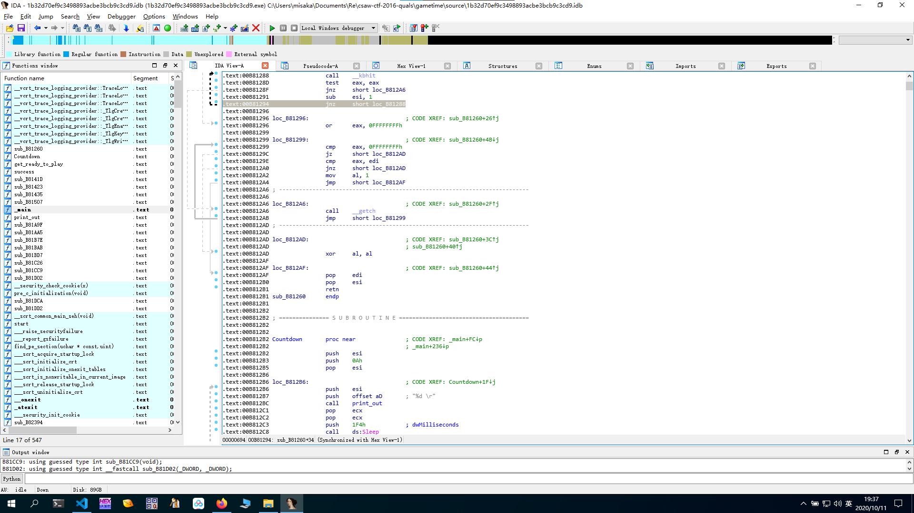
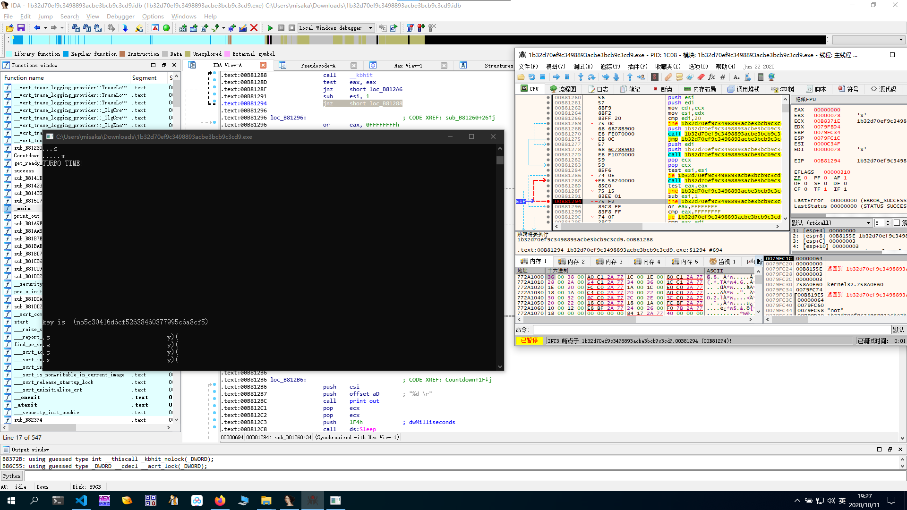

游戏题目,利用动态调试进行

main函数逻辑

```cpp
int __cdecl main(int argc, const char **argv, const char **envp)
{
  int v3; // edi
  unsigned int v4; // eax
  int v5; // ecx
  int v6; // ecx
  int v7; // ecx
  void (__stdcall *v8)(DWORD); // ebx
  signed int v9; // esi
  signed int v10; // esi
  signed int v11; // esi
  signed int v12; // esi
  signed int v13; // esi
  signed int v14; // edi
  int v15; // esi
  int *v16; // esi
  signed int v17; // ebx
  DWORD separate_time; // ST3C_4
  int v19; // esi
  int v20; // eax
  int v21; // esi
  int v22; // eax
  char v23; // cl
  int v24; // eax
  int v26; // [esp+10h] [ebp-20h]
  int v27; // [esp+14h] [ebp-1Ch]
  char v28; // [esp+1Bh] [ebp-15h]
  int v29; // [esp+1Ch] [ebp-14h]
  int v30; // [esp+22h] [ebp-Eh]
  int v31; // [esp+26h] [ebp-Ah]
  __int16 v32; // [esp+2Ah] [ebp-6h]

  LOWORD(v29) = 32;
  v27 = 7630702;
  *(int *)((char *)&v29 + 2) = 0;
  v30 = 0;
  v31 = 0;
  v32 = 0;
  v3 = 0;
  v26 = 0;
  print_out((int)"\r\tZOMGZOMGOZMGZOMGZOMGOZMGZOMGZOMGOZMGZOMGZOMGOZMG\n");
  print_out((int)"\tkey is %s (%s)", &v27, &v29);
  sub_B81423();
  print_out((int)"\r\tZOMGZOMG                                ZOMGZOMG\n");
  print_out((int)"\tkey is %s (%s)", &v27, &v29);
  sub_B81423();
  print_out((int)"\r\tZOMGZOMG     TAP TAP REVOLUTION!!!!!!!  ZOMGZOMG\n");
  print_out((int)"\tkey is %s (%s)", &v27, &v29);
  sub_B81423();
  print_out((int)"\r\tZOMGZOMG                                ZOMGZOMG\n");
  print_out((int)"\tkey is %s (%s)", &v27, &v29);
  sub_B81423();
  print_out((int)"\r\tZOMGZOMGOZMGZOMGZOMGOZMGZOMGZOMGOZMGZOMGZOMGOZMG\n\n\n");
  print_out((int)"\tkey is %s (%s)", &v27, &v29);
  sub_B81423();
  print_out((int)"\r\t              R U READDY?!\n\n\n");
  print_out((int)"\tkey is %s (%s)", &v27, &v29);
  sub_B81423();
  print_out((int)"\rThe game is starting in...\n");
  v4 = _time64(0);
  srand(v4);
  Countdown();
  get_ready_to_play(200u);
  if ( !sub_B81435(0x1F4u, ' ', 10, v5, (int)&v29, (int)&v27) )
    return 0;
  if ( !sub_B81435(0x12Cu, 'x', 8, v6, (int)&v29, (int)&v27) )
    return 0;
  if ( !sub_B81435(0x12Cu, 'm', 5, v7, (int)&v29, (int)&v27) )
    return 0;
  print_out((int)"key is %s (%s)", &v27, &v29);
  print_out((int)"\rTRAINING COMPLETE!                              \n");
  v8 = Sleep;
  v9 = 20;
  do
  {
    Sleep(0xC8u);
    print_out((int)"\n");
    --v9;
  }
  while ( v9 );
  print_out((int)"key is %s (%s)", &v27, &v29);
  print_out((int)"\rNow you know everything you need to know");
  v10 = 4;
  do
  {
    print_out((int)".");
    Sleep(0x3E8u);
    --v10;
  }
  while ( v10 );
  print_out((int)"\n\n\nfor the rest of your life!\n");
  v11 = 20;
  do
  {
    Sleep(0xC8u);
    print_out((int)"\n");
    --v11;
  }
  while ( v11 );
  print_out((int)"LETS PLAY !\n");
  v12 = 20;
  do
  {
    Sleep(0xC8u);
    print_out((int)"\n");
    --v12;
  }
  while ( v12 );
  Countdown();
  get_ready_to_play(100u);
  if ( !sub_B81507(5, ' ', 200u, (int)&v29, (int)&v27) )
    return 0;
  if ( !sub_B81507(2, 'x', 200u, (int)&v29, (int)&v29) )
    return 0;
  if ( !sub_B81507(1, 'm', 200u, (int)&v29, (int)&v29) )
    return 0;
  print_out((int)"key is %s (%s)", &v27, &v29);
  sub_B81423();
  print_out((int)"\rooooh, you fancy!!!\n");
  if ( !sub_B81507(5, 'm', 200u, (int)&v29, (int)&v27)// first_arg为输出的.的数量
    || !sub_B81507(2, 'x', 200u, (int)&v29, (int)&v27)
    || !sub_B81507(1, ' ', 200u, (int)&v29, (int)&v27) )
  {
    return 0;
  }
  print_out((int)"key is %s (%s)", &v27, &v29);
  print_out((int)"\b\b");
  print_out((int)"NIIICE JOB)!!!!\n");
  v13 = 20;
  do
  {
    Sleep(0x32u);
    print_out((int)"\n");
    --v13;
  }
  while ( v13 );
  v28 = 1;
  do
  {
    if ( v3 % 3 == 1 )
    {
      print_out((int)"key is %s (%s)", &v27, &v29);
      sub_B81423();
      print_out((int)"\rTURBO TIME!    \n");
      v14 = 0;
      do
      {
        v8(0x32u);
        print_out((int)"\n");
        if ( v14 == 19 )
        {
          v15 = sub_B8141D();
          sub_B81D02(&v29, v15 - 5514);
          MEMORY[0xB9A1F8] = &v29;
          MEMORY[0xB9A1FC] = v15 - 5498;
          sub_B81AA5();
          sub_B81CC9();
          print_out((int)"key is %s (%s)", &unk_B97D02, &v27);
          print_out((int)"\b\b");
          v16 = &v29;
          v17 = 16;
          do
          {
            separate_time = *(unsigned __int8 *)v16;
            print_out((int)"%02x");
            v16 = (int *)((char *)v16 + 1);
            --v17;
          }
          while ( v17 );
          print_out((int)")\n\n");
          v8 = Sleep;
        }
        ++v14;
      }
      while ( v14 < 20 );
      v19 = 0;
      while ( 1 )
      {
        v20 = rand();
        if ( !sub_B81507(1, byte_B97B08[v20 % 3], 100u, (int)&v29, (int)&v27) )
          break;
        if ( ++v19 >= 10 )
          goto LABEL_33;
      }
      v28 = 0;
LABEL_33:
      v3 = v26;
    }
    v21 = 0;
    while ( 1 )
    {
      v22 = rand();
      v23 = v28;
      v24 = v22 % 3;
      if ( v28 )
        break;
LABEL_38:
      if ( ++v21 >= 10 )
        goto LABEL_41;
    }
    if ( sub_B81507(v24 + 3, byte_B97B08[v24], 100u, (int)&v29, (int)&v27) )
    {
      v23 = v28;
      goto LABEL_38;
    }
    v23 = 0;
    v28 = 0;
LABEL_41:
    if ( v3 == 1337 )
    {
      success();
      v23 = v28;
    }
    v26 = ++v3;
  }
  while ( v23 );
  return 0;
}
```

关键部分(即对输入进行处理)

```cpp
if ( !sub_B81507(5, 'm', 200u, (int)&v29, (int)&v27)// first_arg(5,2,1)为输出的.的数量
    || !sub_B81507(2, 'x', 200u, (int)&v29, (int)&v27)
    || !sub_B81507(1, ' ', 200u, (int)&v29, (int)&v27) )
```

进入该函数

```cpp
char __usercall sub_B81507@<al>(int a1@<edx>, int a2@<ecx>, DWORD dwMilliseconds, int a4, int a5)
{
  int v5; // esi
  int input_char; // ebx

  v5 = a1;
  input_char = a2;
  print_out((int)"key is %s (%s)", a5, a4);
  sub_B81423();
  print_out((int)"\r                                 \r");
  if ( v5 > 0 )
  {
    do
    {
      print_out((int)".");
      Sleep(dwMilliseconds);
      --v5;
    }
    while ( v5 );
  }
  if ( sub_B81260(input_char, 500 * dwMilliseconds) )
    return 1;
  print_out((int)"key is %s (%s)\r", a5, a4);
  print_out((int)"UDDER FAILURE! http://imgur.com/4Ajx21P \n");
  return 0;
}
```

前半部分为输出`key`和`.`

```cpp
v5 = a1;
  input_char = a2;
  print_out((int)"key is %s (%s)", a5, a4);
  sub_B81423();
  print_out((int)"\r                                 \r");
  if ( v5 > 0 )
  {
    do
    {
      print_out((int)".");
      Sleep(dwMilliseconds);
      --v5;
    }
    while ( v5 );
  }
```

此处为关键部分,用于判断输入并进行计时

```cpp
if ( sub_B81260(input_char, 500 * dwMilliseconds) )
    return 1;
```

进入函数

```cpp
bool __fastcall sub_B81260(int a1, int a2)
{
  int input_char; // edi
  int v3; // esi
  int v4; // eax

  input_char = a1;
  v3 = a2;
  if ( a1 == ' ' )
    print_out((int)&unk_B97868);
  else
    print_out((int)&unk_B9786C, a1);
  if ( v3 )
  {
    while ( !_kbhit() )                         // 时间限制
    {
      if ( !--v3 )
        goto LABEL_7;
    }
    v4 = _getch();
  }
  else
  {
LABEL_7:
    v4 = -1;
  }
  return v4 != -1 && v4 == input_char;
}
```

如果超时,则会跳转到`LABEL_7`,则游戏失败,因此,尝试在`goto LABEL_7`处下断点进行调试



将断点下在`B81294`

