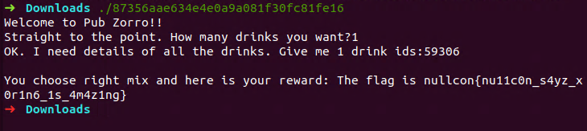

main 函数

```cpp
int __fastcall main(__int64 a1, char **a2, char **a3)
{
  size_t v3; // rax
  int num; // [rsp+1Ch] [rbp-104h]
  int id; // [rsp+20h] [rbp-100h]
  int i; // [rsp+24h] [rbp-FCh]
  unsigned int seed; // [rsp+28h] [rbp-F8h]
  unsigned int v9; // [rsp+2Ch] [rbp-F4h]
  char v10; // [rsp+30h] [rbp-F0h]
  char v11[16]; // [rsp+90h] [rbp-90h]
  char flag[32]; // [rsp+A0h] [rbp-80h]
  char s; // [rsp+C0h] [rbp-60h]
  char s1[40]; // [rsp+E0h] [rbp-40h]
  unsigned __int64 v15; // [rsp+108h] [rbp-18h]

  v15 = __readfsqword(0x28u);
  seed = 0;
  puts("Welcome to Pub Zorro!!");
  printf("Straight to the point. How many drinks you want?", a2);
  __isoc99_scanf("%d", &num);
  if ( num <= 0 )
  {
    printf("You are too drunk!! Get Out!!", &num);
    exit(-1);
  }
  printf("OK. I need details of all the drinks. Give me %d drink ids:", num);
  for ( i = 0; i < num; ++i )
  {
    __isoc99_scanf("%d", &id);
    if ( id <= 16 || id > 65535 )
    {
      puts("Invalid Drink Id.");
      printf("Get Out!!", &id);
      exit(-1);
    }
    seed ^= id;
  }
  i = seed;
  v9 = 0;
  while ( i )                                   
  {
    ++v9;
    i &= i - 1;
  }
  if ( v9 != 10 )
  {
    puts("Looks like its a dangerous combination of drinks right there.");
    puts("Get Out, you will get yourself killed");
    exit(-1);
  }
  srand(seed);
  MD5_Init(&v10);
  for ( i = 0; i <= 29; ++i )
  {
    v9 = rand() % 1000;
    sprintf(&s, "%d", v9);
    v3 = strlen(&s);
    MD5_Update(&v10, &s, v3);
    flag[i] = v9 ^ LOBYTE(unk_6020C0[i]);
  }
  flag[i] = 0;
  MD5_Final(v11, &v10);
  for ( i = 0; i <= 15; ++i )
    sprintf(&s1[2 * i], "%02x", v11[i]);        // v11转16进制保存在s1中
  if ( strcmp(s1, "5eba99aff105c9ff6a1a913e343fec67") )
  {
    puts("Try different mix, This mix is too sloppy");
    exit(-1);
  }
  return printf("\nYou choose right mix and here is your reward: The flag is nullcon{%s}\n", flag);
}
```

根据逻辑在Linux下进行爆破

```cpp
#include "stdio.h"
#include "stdlib.h"
#include "openssl/md5.h"
#include "string.h"

int main(){
    for(int seed=17;seed<=65535;++seed){
        int i=seed,v9=0;
        while(i){
            ++v9;
            i&=i-1;
        }
        if(v9==10){
            srand(seed);
            MD5_CTX v10;
            MD5_Init(&v10);
            unsigned char v11[16];
            char s1[40];
            for (i=0;i<=29;++i){
                v9=rand()%1000;
                char s[5];
                sprintf(s,"%d", v9);
                s[4]=0;
                int v3=strlen(s);
                MD5_Update(&v10,s,v3);
            }
            MD5_Final(v11,&v10);
            for(i=0;i<=15;++i)
                sprintf(&s1[2*i],"%02x",v11[i]);        // v11转16进制保存在s1中
            if(!strcmp(s1,"5eba99aff105c9ff6a1a913e343fec67")){
                printf("%d",seed);
            }
        }
    }
    return 0;
}
```

`gcc test.c -lcrypto -o test`

得到`seed`为`59306`

