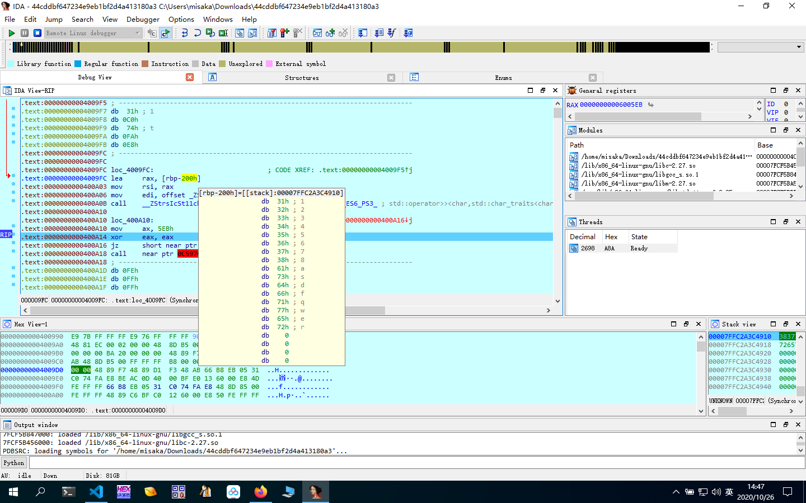
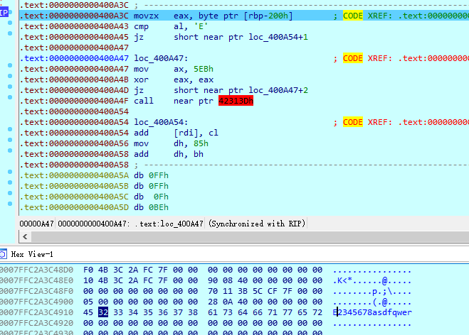
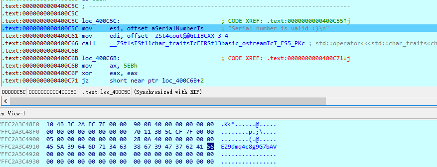

# 静态分析

main函数(未去除混淆)

```s
.text:000000000040099C ; int __cdecl main(int argc, const char **argv, const char **envp)
.text:000000000040099C                 public main
.text:000000000040099C main:                                   ; DATA XREF: _start+1D↑o
.text:000000000040099C ; __unwind { // ___gxx_personality_v0
.text:000000000040099C                 push    rbp
.text:000000000040099D                 mov     rbp, rsp
.text:00000000004009A0                 sub     rsp, 200h
.text:00000000004009A7                 lea     rsi, [rbp-200h]
.text:00000000004009AE                 mov     eax, 0
.text:00000000004009B3                 mov     edx, 20h
.text:00000000004009B8                 mov     rdi, rsi
.text:00000000004009BB                 mov     rcx, rdx
.text:00000000004009BE                 rep stosq
.text:00000000004009C1                 lea     rsi, [rbp-100h]
.text:00000000004009C8                 mov     eax, 0
.text:00000000004009CD                 mov     edx, 20h
.text:00000000004009D2                 mov     rdi, rsi
.text:00000000004009D5                 mov     rcx, rdx
.text:00000000004009D8                 rep stosq
.text:00000000004009DB
.text:00000000004009DB loc_4009DB:                             ; CODE XREF: .text:00000000004009E1↓j
.text:00000000004009DB                 mov     ax, 5EBh
.text:00000000004009DF                 xor     eax, eax
.text:00000000004009E1                 jz      short near ptr loc_4009DB+2
.text:00000000004009E3                 call    near ptr 404DB6A6h
.text:00000000004009E8                 add     ds:_ZSt4cout@@GLIBCXX_3_4[rdi], bh
.text:00000000004009EE ;   try {
.text:00000000004009EE                 call    __ZStlsISt11char_traitsIcEERSt13basic_ostreamIcT_ES5_PKc ; std::operator<<<std::char_traits<char>>(std::basic_ostream<char,std::char_traits<char>> &,char const*)
.text:00000000004009F3
.text:00000000004009F3 loc_4009F3:                             ; CODE XREF: .text:00000000004009F9↓j
.text:00000000004009F3                 mov     ax, 5EBh
.text:00000000004009F7                 xor     eax, eax
.text:00000000004009F9                 jz      short near ptr loc_4009F3+2
.text:00000000004009FB                 call    near ptr 0C59748h
.text:00000000004009FB ; ---------------------------------------------------------------------------
.text:0000000000400A00                 dq 0C0BFC68948FFFFFEh, 0FFFFFE50E8006012h, 0FA74C03105EBB866h
.text:0000000000400A00                 dq 0FFFFFE00858D48E8h, 0FFFFFE28E8C78948h, 0B8660E7410F88348h
.text:0000000000400A00                 dq 0E9E8FA74C03105EBh, 85B60F0000023Fh, 660E74453CFFFFFEh
.text:0000000000400A00                 dq 0E8FA74C03105EBB8h, 85B60F00000226E9h, 0FD0BE0FFFFFFE00h
.text:0000000000400A00                 dq 0BE0FFFFFFE0F85B6h, 9B3DD001C0h, 0C03105EBB8660E74h
.text:0000000000400A00                 dq 1FBE9E8FA74h, 3CFFFFFE0185B60Fh, 3105EBB8660E745Ah
.text:0000000000400A00                 dq 1E2E9E8FA74C0h, 0FFFFFE0185B60F00h, 0FE0E85B60FD0BE0Fh
.text:0000000000400A00                 dq 3DD001C0BE0FFFFFh, 0B8660E740000009Bh, 0E9E8FA74C03105EBh
.text:0000000000400A00                 dq 285B60F000001B7h, 660E74393CFFFFFEh, 0E8FA74C03105EBB8h
.text:0000000000400A00                 dq 85B60F0000019EE9h, 0FD0BE0FFFFFFE02h, 0BE0FFFFFFE0D85B6h
.text:0000000000400A00                 dq 9B3DD001C0h, 0C03105EBB8660E74h, 173E9E8FA74h, 3CFFFFFE0385B60Fh
.text:0000000000400A00                 dq 3105EBB8660E7464h, 15AE9E8FA74C0h, 0FFFFFE0385B60F00h
.text:0000000000400A00                 dq 0FE0C85B60FD0BE0Fh, 3DD001C0BE0FFFFFh, 0B8660E740000009Bh
.text:0000000000400A00                 dq 0E9E8FA74C03105EBh, 485B60F0000012Fh, 660E746D3CFFFFFEh
.text:0000000000400A00                 dq 0E8FA74C03105EBB8h, 85B60F00000116E9h, 0FD0BE0FFFFFFE04h
.text:0000000000400A00                 dq 0BE0FFFFFFE0B85B6h, 0B43DD001C0h, 0C03105EBB8660E74h
.text:0000000000400A00                 dq 0EBE9E8FA74h, 3CFFFFFE0585B60Fh, 3105EBB8660E7471h
.text:0000000000400A00                 dq 0D2E9E8FA74C0h, 0FFFFFE0585B60F00h, 0FE0A85B60FD0BE0Fh
.text:0000000000400A00                 dq 3DD001C0BE0FFFFFh, 0B8660E74000000AAh, 0E9E8FA74C03105EBh
.text:0000000000400A00                 dq 685B60F000000A7h, 660E74343CFFFFFEh, 0E8FA74C03105EBB8h
.text:0000000000400A00                 dq 85B60F0000008EE9h, 0FD0BE0FFFFFFE06h, 0BE0FFFFFFE0985B6h
.text:0000000000400A00                 dq 9B3DD001C0h, 0C03105EBB8660B74h, 85B60F66EBE8FA74h
.text:0000000000400A00                 dq 0B74633CFFFFFE07h, 0FA74C03105EBB866h, 0FE0785B60F50EBE8h
.text:0000000000400A00                 dq 85B60FD0BE0FFFFFh, 1C0BE0FFFFFFE08h, 0B740000009B3DD0h
.text:0000000000400A00                 dq 0FA74C03105EBB866h, 3105EBB86628EBE8h, 400DC9BEE8FA74C0h
.text:0000000000400A00                 dq 0D5E8006013E0BF00h, 3105EBB866FFFFFBh, 0B8E8FA74C0h
.text:0000000000400A00                 dq 3105EBB86626EB00h, 400DE4BEE8FA74C0h, 0ADE8006013E0BF00h
.text:0000000000400A00                 dq 3105EBB866FFFFFBh, 0B8E8FA74C0h
.text:0000000000400CA0                 db 0, 0EBh, 8
.text:0000000000400CA3 ; ---------------------------------------------------------------------------
.text:0000000000400CA3 ;   cleanup() // owned by 4009EE
.text:0000000000400CA3                 mov     rdi, rax
.text:0000000000400CA6                 call    __Unwind_Resume
.text:0000000000400CAB ; ---------------------------------------------------------------------------
.text:0000000000400CAB                 leave
.text:0000000000400CAC                 retn
.text:0000000000400CAC ; } // starts at 40099C
```

去除混淆

```s
.text:0000000000400A19                 lea     rax, [rbp-200h]
.text:0000000000400A20                 mov     rdi, rax
.text:0000000000400A23                 call    _strlen
.text:0000000000400A28                 cmp     rax, 16         ; 输入长度为16
.text:0000000000400A2C                 jz      short loc_400A3C
.text:0000000000400A2E
.text:0000000000400A2E loc_400A2E:                             ; CODE XREF: .text:0000000000400A34↓j
.text:0000000000400A2E                 mov     ax, 5EBh
.text:0000000000400A32                 xor     eax, eax
.text:0000000000400A34                 jz      short near ptr loc_400A2E+2
.text:0000000000400A34 ; ---------------------------------------------------------------------------
.text:0000000000400A36                 db 0E8h
.text:0000000000400A37 ; ---------------------------------------------------------------------------
.text:0000000000400A37                 jmp     near ptr loc_400C7A+1
.text:0000000000400A3C ; ---------------------------------------------------------------------------
.text:0000000000400A3C
.text:0000000000400A3C loc_400A3C:                             ; CODE XREF: .text:0000000000400A2C↑j
.text:0000000000400A3C                 movzx   eax, byte ptr [rbp-200h]
.text:0000000000400A43                 cmp     al, 'E'         ; input[0]=E
.text:0000000000400A45                 jz      short loc_400A55
.text:0000000000400A45 ; ---------------------------------------------------------------------------
.text:0000000000400A47                 db  66h ; f
.text:0000000000400A48                 db 0B8h
.text:0000000000400A49                 db 0EBh
.text:0000000000400A4A                 db    5
.text:0000000000400A4B                 db  31h ; 1
.text:0000000000400A4C                 db 0C0h
.text:0000000000400A4D                 db  74h ; t
.text:0000000000400A4E                 db 0FAh
.text:0000000000400A4F                 db 0E8h
.text:0000000000400A50                 db 0E9h
.text:0000000000400A51                 db  26h ; &
.text:0000000000400A52                 db    2
.text:0000000000400A53                 db    0
.text:0000000000400A54                 db    0
.text:0000000000400A55 ; ---------------------------------------------------------------------------
.text:0000000000400A55
.text:0000000000400A55 loc_400A55:                             ; CODE XREF: .text:0000000000400A45↑j
.text:0000000000400A55                 movzx   eax, byte ptr [rbp-200h]
.text:0000000000400A5C                 movsx   edx, al
.text:0000000000400A5F                 movzx   eax, byte ptr [rbp-1F1h]
.text:0000000000400A66                 movsx   eax, al
.text:0000000000400A69                 add     eax, edx
.text:0000000000400A6B                 cmp     eax, 9Bh        ; input[0]+input[15]=0x9b
.text:0000000000400A70                 jz      short loc_400A80
.text:0000000000400A70 ; ---------------------------------------------------------------------------
.text:0000000000400A72                 db  66h ; f
.text:0000000000400A73                 db 0B8h
.text:0000000000400A74                 db 0EBh
.text:0000000000400A75                 db    5
.text:0000000000400A76                 db  31h ; 1
.text:0000000000400A77                 db 0C0h
.text:0000000000400A78                 db  74h ; t
.text:0000000000400A79                 db 0FAh
.text:0000000000400A7A                 db 0E8h
.text:0000000000400A7B                 db 0E9h
.text:0000000000400A7C                 db 0FBh
.text:0000000000400A7D                 db    1
.text:0000000000400A7E                 db    0
.text:0000000000400A7F                 db    0
.text:0000000000400A80 ; ---------------------------------------------------------------------------
.text:0000000000400A80
.text:0000000000400A80 loc_400A80:                             ; CODE XREF: .text:0000000000400A70↑j
.text:0000000000400A80                 movzx   eax, byte ptr [rbp-1FFh]
.text:0000000000400A87                 cmp     al, 'Z'         ; input[1]=Z
.text:0000000000400A89                 jz      short loc_400A99
.text:0000000000400A89 ; ---------------------------------------------------------------------------
.text:0000000000400A8B                 db  66h ; f
.text:0000000000400A8C                 db 0B8h
.text:0000000000400A8D                 db 0EBh
.text:0000000000400A8E                 db    5
.text:0000000000400A8F                 db  31h ; 1
.text:0000000000400A90                 db 0C0h
.text:0000000000400A91                 db  74h ; t
.text:0000000000400A92                 db 0FAh
.text:0000000000400A93                 db 0E8h
.text:0000000000400A94                 db 0E9h
.text:0000000000400A95                 db 0E2h
.text:0000000000400A96                 db    1
.text:0000000000400A97                 db    0
.text:0000000000400A98                 db    0
.text:0000000000400A99 ; ---------------------------------------------------------------------------
.text:0000000000400A99
.text:0000000000400A99 loc_400A99:                             ; CODE XREF: .text:0000000000400A89↑j
.text:0000000000400A99                 movzx   eax, byte ptr [rbp-1FFh]
.text:0000000000400AA0                 movsx   edx, al
.text:0000000000400AA3                 movzx   eax, byte ptr [rbp-1F2h]
.text:0000000000400AAA                 movsx   eax, al
.text:0000000000400AAD                 add     eax, edx
.text:0000000000400AAF                 cmp     eax, 9Bh        ; input[1]+input[14]=0x9b
.text:0000000000400AB4                 jz      short loc_400AC4
.text:0000000000400AB4 ; ---------------------------------------------------------------------------
.text:0000000000400AB6                 db  66h ; f
.text:0000000000400AB7                 db 0B8h
.text:0000000000400AB8                 db 0EBh
.text:0000000000400AB9                 db    5
.text:0000000000400ABA                 db  31h ; 1
.text:0000000000400ABB                 db 0C0h
.text:0000000000400ABC                 db  74h ; t
.text:0000000000400ABD                 db 0FAh
.text:0000000000400ABE                 db 0E8h
.text:0000000000400ABF                 db 0E9h
.text:0000000000400AC0                 db 0B7h
.text:0000000000400AC1                 db    1
.text:0000000000400AC2                 db    0
.text:0000000000400AC3                 db    0
.text:0000000000400AC4 ; ---------------------------------------------------------------------------
.text:0000000000400AC4
.text:0000000000400AC4 loc_400AC4:                             ; CODE XREF: .text:0000000000400AB4↑j
.text:0000000000400AC4                 movzx   eax, byte ptr [rbp-1FEh]
.text:0000000000400ACB                 cmp     al, '9'         ; input[2]=9
.text:0000000000400ACD                 jz      short loc_400ADD
.text:0000000000400ACD ; ---------------------------------------------------------------------------
.text:0000000000400ACF                 db  66h ; f
.text:0000000000400AD0                 db 0B8h
.text:0000000000400AD1                 db 0EBh
.text:0000000000400AD2                 db    5
.text:0000000000400AD3                 db  31h ; 1
.text:0000000000400AD4                 db 0C0h
.text:0000000000400AD5                 db  74h ; t
.text:0000000000400AD6                 db 0FAh
.text:0000000000400AD7                 db 0E8h
.text:0000000000400AD8                 db 0E9h
.text:0000000000400AD9                 db  9Eh
.text:0000000000400ADA                 db    1
.text:0000000000400ADB                 db    0
.text:0000000000400ADC                 db    0
.text:0000000000400ADD ; ---------------------------------------------------------------------------
.text:0000000000400ADD
.text:0000000000400ADD loc_400ADD:                             ; CODE XREF: .text:0000000000400ACD↑j
.text:0000000000400ADD                 movzx   eax, byte ptr [rbp-1FEh]
.text:0000000000400AE4                 movsx   edx, al
.text:0000000000400AE7                 movzx   eax, byte ptr [rbp-1F3h]
.text:0000000000400AEE                 movsx   eax, al
.text:0000000000400AF1                 add     eax, edx
.text:0000000000400AF3                 cmp     eax, 9Bh        ; input[2]+input[13]=0x9b
.text:0000000000400AF8                 jz      short loc_400B08
.text:0000000000400AF8 ; ---------------------------------------------------------------------------
.text:0000000000400AFA                 db  66h ; f
.text:0000000000400AFB                 db 0B8h
.text:0000000000400AFC                 db 0EBh
.text:0000000000400AFD                 db    5
.text:0000000000400AFE                 db  31h ; 1
.text:0000000000400AFF                 db 0C0h
.text:0000000000400B00                 db  74h ; t
.text:0000000000400B01                 db 0FAh
.text:0000000000400B02                 db 0E8h
.text:0000000000400B03                 db 0E9h
.text:0000000000400B04                 db  73h ; s
.text:0000000000400B05                 db    1
.text:0000000000400B06                 db    0
.text:0000000000400B07                 db    0
.text:0000000000400B08 ; ---------------------------------------------------------------------------
.text:0000000000400B08
.text:0000000000400B08 loc_400B08:                             ; CODE XREF: .text:0000000000400AF8↑j
.text:0000000000400B08                 movzx   eax, byte ptr [rbp-1FDh]
.text:0000000000400B0F                 cmp     al, 'd'         ; input[3]=d
.text:0000000000400B11                 jz      short loc_400B21
.text:0000000000400B11 ; ---------------------------------------------------------------------------
.text:0000000000400B13                 db  66h ; f
.text:0000000000400B14                 db 0B8h
.text:0000000000400B15                 db 0EBh
.text:0000000000400B16                 db    5
.text:0000000000400B17                 db  31h ; 1
.text:0000000000400B18                 db 0C0h
.text:0000000000400B19                 db  74h ; t
.text:0000000000400B1A                 db 0FAh
.text:0000000000400B1B                 db 0E8h
.text:0000000000400B1C                 db 0E9h
.text:0000000000400B1D                 db  5Ah ; Z
.text:0000000000400B1E                 db    1
.text:0000000000400B1F                 db    0
.text:0000000000400B20                 db    0
.text:0000000000400B21 ; ---------------------------------------------------------------------------
.text:0000000000400B21
.text:0000000000400B21 loc_400B21:                             ; CODE XREF: .text:0000000000400B11↑j
.text:0000000000400B21                 movzx   eax, byte ptr [rbp-1FDh]
.text:0000000000400B28                 movsx   edx, al
.text:0000000000400B2B                 movzx   eax, byte ptr [rbp-1F4h]
.text:0000000000400B32                 movsx   eax, al
.text:0000000000400B35                 add     eax, edx
.text:0000000000400B37                 cmp     eax, 9Bh        ; input[3]+input[12]=0x9b
.text:0000000000400B3C                 jz      short loc_400B4C
.text:0000000000400B3C ; ---------------------------------------------------------------------------
.text:0000000000400B3E                 db  66h ; f
.text:0000000000400B3F                 db 0B8h
.text:0000000000400B40                 db 0EBh
.text:0000000000400B41                 db    5
.text:0000000000400B42                 db  31h ; 1
.text:0000000000400B43                 db 0C0h
.text:0000000000400B44                 db  74h ; t
.text:0000000000400B45                 db 0FAh
.text:0000000000400B46                 db 0E8h
.text:0000000000400B47                 db 0E9h
.text:0000000000400B48                 db  2Fh ; /
.text:0000000000400B49                 db    1
.text:0000000000400B4A                 db    0
.text:0000000000400B4B                 db    0
.text:0000000000400B4C ; ---------------------------------------------------------------------------
.text:0000000000400B4C
.text:0000000000400B4C loc_400B4C:                             ; CODE XREF: .text:0000000000400B3C↑j
.text:0000000000400B4C                 movzx   eax, byte ptr [rbp-1FCh]
.text:0000000000400B53                 cmp     al, 'm'         ; input[4]=m
.text:0000000000400B55                 jz      short loc_400B65
.text:0000000000400B57
.text:0000000000400B57 loc_400B57:                             ; CODE XREF: .text:0000000000400B5D↓j
.text:0000000000400B57                 mov     ax, 5EBh
.text:0000000000400B5B                 xor     eax, eax
.text:0000000000400B5D                 jz      short near ptr loc_400B57+2
.text:0000000000400B5D ; ---------------------------------------------------------------------------
.text:0000000000400B5F                 db 0E8h
.text:0000000000400B60                 db 0E9h
.text:0000000000400B61                 db  16h
.text:0000000000400B62                 db    1
.text:0000000000400B63                 db    0
.text:0000000000400B64                 db    0
.text:0000000000400B65 ; ---------------------------------------------------------------------------
.text:0000000000400B65
.text:0000000000400B65 loc_400B65:                             ; CODE XREF: .text:0000000000400B55↑j
.text:0000000000400B65                 movzx   eax, byte ptr [rbp-1FCh]
.text:0000000000400B6C                 movsx   edx, al
.text:0000000000400B6F                 movzx   eax, byte ptr [rbp-1F5h]
.text:0000000000400B76                 movsx   eax, al
.text:0000000000400B79                 add     eax, edx
.text:0000000000400B7B                 cmp     eax, 0B4h       ; input[4]+input[11]=0xb4
.text:0000000000400B80                 jz      short loc_400B90
.text:0000000000400B80 ; ---------------------------------------------------------------------------
.text:0000000000400B82                 db  66h ; f
.text:0000000000400B83                 db 0B8h
.text:0000000000400B84                 db 0EBh
.text:0000000000400B85                 db    5
.text:0000000000400B86                 db  31h ; 1
.text:0000000000400B87                 db 0C0h
.text:0000000000400B88                 db  74h ; t
.text:0000000000400B89                 db 0FAh
.text:0000000000400B8A                 db 0E8h
.text:0000000000400B8B                 db 0E9h
.text:0000000000400B8C                 db 0EBh
.text:0000000000400B8D                 db    0
.text:0000000000400B8E                 db    0
.text:0000000000400B8F                 db    0
.text:0000000000400B90 ; ---------------------------------------------------------------------------
.text:0000000000400B90
.text:0000000000400B90 loc_400B90:                             ; CODE XREF: .text:0000000000400B80↑j
.text:0000000000400B90                 movzx   eax, byte ptr [rbp-1FBh]
.text:0000000000400B97                 cmp     al, 'q'         ; input[5]=q
.text:0000000000400B99                 jz      short loc_400BA9
.text:0000000000400B99 ; ---------------------------------------------------------------------------
.text:0000000000400B9B                 db  66h ; f
.text:0000000000400B9C                 db 0B8h
.text:0000000000400B9D                 db 0EBh
.text:0000000000400B9E                 db    5
.text:0000000000400B9F                 db  31h ; 1
.text:0000000000400BA0                 db 0C0h
.text:0000000000400BA1                 db  74h ; t
.text:0000000000400BA2                 db 0FAh
.text:0000000000400BA3                 db 0E8h
.text:0000000000400BA4                 db 0E9h
.text:0000000000400BA5                 db 0D2h
.text:0000000000400BA6                 db    0
.text:0000000000400BA7                 db    0
.text:0000000000400BA8                 db    0
.text:0000000000400BA9 ; ---------------------------------------------------------------------------
.text:0000000000400BA9
.text:0000000000400BA9 loc_400BA9:                             ; CODE XREF: .text:0000000000400B99↑j
.text:0000000000400BA9                 movzx   eax, byte ptr [rbp-1FBh]
.text:0000000000400BB0                 movsx   edx, al
.text:0000000000400BB3                 movzx   eax, byte ptr [rbp-1F6h]
.text:0000000000400BBA                 movsx   eax, al
.text:0000000000400BBD                 add     eax, edx
.text:0000000000400BBF                 cmp     eax, 0AAh       ; input[5]+input[10]=0xaa
.text:0000000000400BC4                 jz      short loc_400BD4
.text:0000000000400BC4 ; ---------------------------------------------------------------------------
.text:0000000000400BC6                 db  66h ; f
.text:0000000000400BC7                 db 0B8h
.text:0000000000400BC8                 db 0EBh
.text:0000000000400BC9                 db    5
.text:0000000000400BCA                 db  31h ; 1
.text:0000000000400BCB                 db 0C0h
.text:0000000000400BCC                 db  74h ; t
.text:0000000000400BCD                 db 0FAh
.text:0000000000400BCE                 db 0E8h
.text:0000000000400BCF                 db 0E9h
.text:0000000000400BD0                 db 0A7h
.text:0000000000400BD1                 db    0
.text:0000000000400BD2                 db    0
.text:0000000000400BD3                 db    0
.text:0000000000400BD4 ; ---------------------------------------------------------------------------
.text:0000000000400BD4
.text:0000000000400BD4 loc_400BD4:                             ; CODE XREF: .text:0000000000400BC4↑j
.text:0000000000400BD4                 movzx   eax, byte ptr [rbp-1FAh]
.text:0000000000400BDB                 cmp     al, '4'         ; input[6]=4
.text:0000000000400BDD                 jz      short loc_400BED
.text:0000000000400BDD ; ---------------------------------------------------------------------------
.text:0000000000400BDF                 db  66h ; f
.text:0000000000400BE0                 db 0B8h
.text:0000000000400BE1                 db 0EBh
.text:0000000000400BE2                 db    5
.text:0000000000400BE3                 db  31h ; 1
.text:0000000000400BE4                 db 0C0h
.text:0000000000400BE5                 db  74h ; t
.text:0000000000400BE6                 db 0FAh
.text:0000000000400BE7                 db 0E8h
.text:0000000000400BE8                 db 0E9h
.text:0000000000400BE9                 db  8Eh
.text:0000000000400BEA                 db    0
.text:0000000000400BEB                 db    0
.text:0000000000400BEC                 db    0
.text:0000000000400BED ; ---------------------------------------------------------------------------
.text:0000000000400BED
.text:0000000000400BED loc_400BED:                             ; CODE XREF: .text:0000000000400BDD↑j
.text:0000000000400BED                 movzx   eax, byte ptr [rbp-1FAh]
.text:0000000000400BF4                 movsx   edx, al
.text:0000000000400BF7                 movzx   eax, byte ptr [rbp-1F7h]
.text:0000000000400BFE                 movsx   eax, al
.text:0000000000400C01                 add     eax, edx
.text:0000000000400C03                 cmp     eax, 9Bh        ; input[6]+input[9]=0x9b
.text:0000000000400C08                 jz      short loc_400C15
.text:0000000000400C08 ; ---------------------------------------------------------------------------
.text:0000000000400C0A                 db  66h ; f
.text:0000000000400C0B                 db 0B8h
.text:0000000000400C0C                 db 0EBh
.text:0000000000400C0D                 db    5
.text:0000000000400C0E                 db  31h ; 1
.text:0000000000400C0F                 db 0C0h
.text:0000000000400C10                 db  74h ; t
.text:0000000000400C11                 db 0FAh
.text:0000000000400C12                 db 0E8h
.text:0000000000400C13                 db 0EBh
.text:0000000000400C14                 db  66h ; f
.text:0000000000400C15 ; ---------------------------------------------------------------------------
.text:0000000000400C15
.text:0000000000400C15 loc_400C15:                             ; CODE XREF: .text:0000000000400C08↑j
.text:0000000000400C15                 movzx   eax, byte ptr [rbp-1F9h]
.text:0000000000400C1C                 cmp     al, 'c'         ; input[7]=c
.text:0000000000400C1E                 jz      short loc_400C2B
.text:0000000000400C1E ; ---------------------------------------------------------------------------
.text:0000000000400C20                 db  66h ; f
.text:0000000000400C21                 db 0B8h
.text:0000000000400C22                 db 0EBh
.text:0000000000400C23                 db    5
.text:0000000000400C24                 db  31h ; 1
.text:0000000000400C25                 db 0C0h
.text:0000000000400C26                 db  74h ; t
.text:0000000000400C27                 db 0FAh
.text:0000000000400C28                 db 0E8h
.text:0000000000400C29                 db 0EBh
.text:0000000000400C2A                 db  50h ; P
.text:0000000000400C2B ; ---------------------------------------------------------------------------
.text:0000000000400C2B
.text:0000000000400C2B loc_400C2B:                             ; CODE XREF: .text:0000000000400C1E↑j
.text:0000000000400C2B                 movzx   eax, byte ptr [rbp-1F9h]
.text:0000000000400C32                 movsx   edx, al
.text:0000000000400C35                 movzx   eax, byte ptr [rbp-1F8h]
.text:0000000000400C3C                 movsx   eax, al
.text:0000000000400C3F                 add     eax, edx
.text:0000000000400C41                 cmp     eax, 9Bh        ; input[7]+input[8]=0x9b
.text:0000000000400C46                 jz      short loc_400C53
```

可提取的信息为

输入长度为16

```s
input[0]=E
input[0]+input[15]=0x9b
input[1]=Z
input[1]+input[14]=0x9b
input[2]=9
input[2]+input[13]=0x9b
input[3]=d
input[3]+input[12]=0x9b
input[4]=m
input[4]+input[11]=0xb4
input[5]=q
input[5]+input[10]=0xaa
input[6]=4
input[6]+input[9]=0x9b
input[7]=c
input[7]+input[8]=0x9b
```

可得flag为`EZ9dmq4c8g9G7bAV`

# 动态分析

输入的字符串被保存在`[rbp-200h]`



然后跳转到strlen进行长度比较(长度应为16)

```s
.text:0000000000400A19 loc_400A19:                             ; CODE XREF: .text:0000000000400A12↑j
.text:0000000000400A19 lea     rax, [rbp-200h]
.text:0000000000400A20 mov     rdi, rax
.text:0000000000400A23 call    _strlen
.text:0000000000400A28 cmp     rax, 10h
.text:0000000000400A2C jz      short near ptr loc_400A3B+1
```

判断第一个字符是否为`E`

```s
.text:0000000000400A3C movzx   eax, byte ptr [rbp-200h]        ; CODE XREF: .text:0000000000400A2C↑j
.text:0000000000400A43 cmp     al, 'E'
.text:0000000000400A45 jz      short near ptr loc_400A54+1
```

手动对内存中的字符串进行修改,使其满足上述条件



第一个字符和最后一个字符相加等于`0x9b`,即最后一个字符为`V`

```s
.text:0000000000400A55 movzx   eax, byte ptr [rbp-200h]        ; CODE XREF: .text:0000000000400A45↑j
.text:0000000000400A5C movsx   edx, al
.text:0000000000400A5F movzx   eax, byte ptr [rbp-1F1h]
.text:0000000000400A66 movsx   eax, al
.text:0000000000400A69 add     eax, edx
.text:0000000000400A6B cmp     eax, 9Bh
.text:0000000000400A70 jz      short near ptr loc_400A7F+1
```

不断重复以上步骤,最终得到flag

