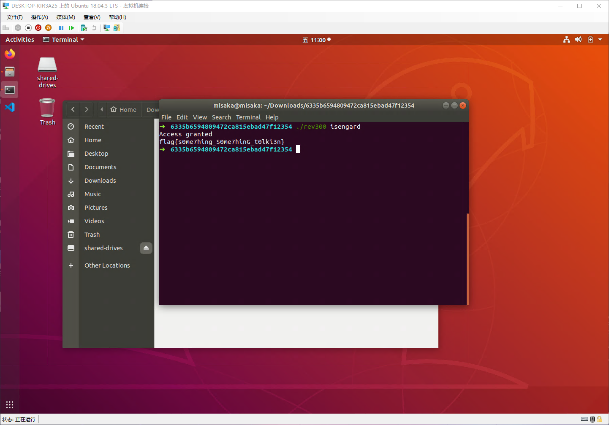

main函数

```cpp
int __cdecl main(int a1, char **a2)
{
  if ( a1 > 1 && sub_8048414(a2[1], 0) )
  {
    puts("Access granted");
    sub_8048538((int)a2[1]);
  }
  else
  {
    puts("Access denied");
  }
  return 0;
}
```

sub_8048414 函数

```cpp
signed int __cdecl sub_8048414(_BYTE *a1, int a2)
{
  signed int result; // eax

  switch ( a2 )
  {
    case 0:
      if ( *a1 == 'i' )
        goto LABEL_19;
      result = 0;
      break;
    case 1:
      if ( *a1 == 'e' )
        goto LABEL_19;
      result = 0;
      break;
    case 3:
      if ( *a1 == 'n' )
        goto LABEL_19;
      result = 0;
      break;
    case 4:
      if ( *a1 == 'd' )
        goto LABEL_19;
      result = 0;
      break;
    case 5:
      if ( *a1 == 'a' )
        goto LABEL_19;
      result = 0;
      break;
    case 6:
      if ( *a1 == 'g' )
        goto LABEL_19;
      result = 0;
      break;
    case 7:
      if ( *a1 == 's' )
        goto LABEL_19;
      result = 0;
      break;
    case 9:
      if ( *a1 == 'r' )
LABEL_19:
        result = sub_8048414(a1 + 1, 7 * (a2 + 1) % 11);
      else
        result = 0;
      break;
    default:
      result = 1;
      break;
  }
  return result;
}
```

可以得出,a1是一个字符串,sub_8048414 函数读取字符串中的字符进行判断,直到result等于1,由此可以逆推出a1

```cpp
#include<iostream>
using namespace std;
void fun(int a){
    if(a==0){
        cout<<"i";
        fun(7*(a+1)%11);
    }
    else if(a==1){
        cout<<"e";
        fun(7*(a+1)%11);
    }
    else if(a==3){
        cout<<"n";
        fun(7*(a+1)%11);
    }
    else if(a==4){
        cout<<"d";
        fun(7*(a+1)%11);
    }
    else if(a==5){
        cout<<"a";
        fun(7*(a+1)%11);
    }
    else if(a==6){
        cout<<"g";
        fun(7*(a+1)%11);
    }
    else if(a==7){
        cout<<"s";
        fun(7*(a+1)%11);
    }
    else if(a==9){
        cout<<"r";
        fun(7*(a+1)%11);
    }
}
int main(){
    fun(0);
    return 0;
}
```

`isengard`

sub_8048538 函数

```cpp
int __cdecl sub_8048538(int a1)
{
  int v2[33]; // [esp+18h] [ebp-A0h]
  int i; // [esp+9Ch] [ebp-1Ch]

  qmemcpy(v2, &unk_8048760, sizeof(v2));
  for ( i = 0; i <= 32; ++i )
    putchar(v2[i] ^ *(char *)(a1 + i % 8));
  return putchar(10);
}
```

对a1字符串进行处理,得到flag

```py
v2=[15, 31, 4, 9, 28, 18, 66, 9, 12, 68, 13, 7, 9, 6, 45, 55, 89, 30, 0, 89, 15, 8, 28, 35, 54, 7, 85, 2, 12, 8, 65, 10, 20]
a="isengard"
for i in range(33):
    print(chr(v2[i]^ord(a[i%8])),end="")
```

`flag{s0me7hing_S0me7hinG_t0lki3n}`

也可以直接运行

