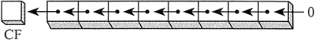

1. `SHL`与`SHR`

`SHL` 左移指令使目的操作数逻辑左移一位,最低位用`0`填充,最高位移入进位标志位,而进位标志位中原来的数值被丢弃

`SHR` 右移指令使目的操作数逻辑右移一位,最高位用`0`填充,最低位移入进位标志位,而进位标志位中原来的数值被丢弃

2. `SAL`与`SAR`

`SAL` 算术左移指令与`SHL`指令相同

`SAR` 算术右移指令将目的操作数进行算术右移

`SAR`会根据最高位是否为1来拓展符号位

假设`AX=1000 0000`,`SAR AX 1`,`AX=1100 0000`