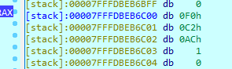
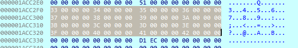
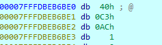
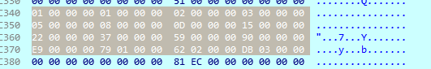
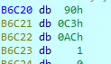
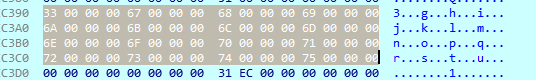
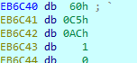
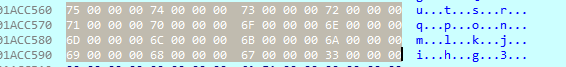
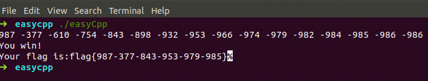

首先进行静态分析

main函数

```cpp
int __cdecl main(int argc, const char **argv, const char **envp)
{
  char v3; // r14
  char v4; // r15
  __int64 v5; // rdx
  __int64 v6; // rdx
  __int64 v7; // rdx
  __int64 v8; // rdx
  __int64 input_vector_temp_back_inserter; // r12
  __int64 input_vector_end; // rbx
  __int64 input_vector[1]; // rax
  __int64 v12; // rdx
  __int64 input_vector_temp_end; // rbx
  __int64 input_vector_temp_begin; // rax
  __int64 v15; // r8
  __int64 v16; // r9
  __int64 flag_end; // r12
  __int64 input_vector_end_1; // rbx
  __int64 input_vector_begin_1; // rax
  __int64 v20; // rcx
  __int64 v21; // r8
  __int64 v22; // r9
  unsigned int *v23; // rax
  const char **v25; // [rsp+0h] [rbp-190h]
  signed int i; // [rsp+1Ch] [rbp-174h]
  signed int j; // [rsp+20h] [rbp-170h]
  char fib_vector; // [rsp+30h] [rbp-160h]
  char input_vector; // [rsp+50h] [rbp-140h]
  char input_vector_temp; // [rsp+70h] [rbp-120h]
  char input_vector_; // [rsp+90h] [rbp-100h]
  char flag; // [rsp+B0h] [rbp-E0h]
  __int64 v33; // [rsp+D0h] [rbp-C0h]
  __int64 input_vector_begin; // [rsp+F0h] [rbp-A0h]
  char input_array[72]; // [rsp+110h] [rbp-80h]
  unsigned __int64 v36; // [rsp+158h] [rbp-38h]

  v25 = argv;
  v36 = __readfsqword(0x28u);
  std::vector<int,std::allocator<int>>::vector(&fib_vector, argv, envp);
  std::vector<int,std::allocator<int>>::vector(&input_vector, argv, v5);
  std::vector<int,std::allocator<int>>::vector(&input_vector_temp, argv, v6);
  std::vector<int,std::allocator<int>>::vector(&input_vector_, argv, v7);
  std::vector<int,std::allocator<int>>::vector(&flag, argv, v8);
  for ( i = 0; i <= 15; ++i )
  {
    scanf("%d", &input_array[4 * i], v25);
    std::vector<int,std::allocator<int>>::push_back(&input_vector, &input_array[4 * i]);
  }
  for ( j = 0; j <= 15; ++j )
  {
    LODWORD(input_vector_begin) = fib(j);       // 斐波那契数列
    std::vector<int,std::allocator<int>>::push_back(&fib_vector, &input_vector_begin);
  }
  std::vector<int,std::allocator<int>>::push_back(&input_vector_temp, input_array);
  input_vector_temp_back_inserter = std::back_inserter<std::vector<int,std::allocator<int>>>(&input_vector_temp);
  input_vector_end = std::vector<int,std::allocator<int>>::end(&input_vector);
  input_vector_begin = std::vector<int,std::allocator<int>>::begin(&input_vector);
  input_vector[1] = __gnu_cxx::__normal_iterator<int *,std::vector<int,std::allocator<int>>>::operator+(
                      &input_vector_begin,
                      1LL);
  std::transform<__gnu_cxx::__normal_iterator<int *,std::vector<int,std::allocator<int>>>,std::back_insert_iterator<std::vector<int,std::allocator<int>>>,main::{lambda(int)#1}>(
    input_vector[1],
    input_vector_end,
    input_vector_temp_back_inserter,
    (__int64)input_array);                      // input_vector_temp[0]=input_vector[0]+input_vector[1]
                                                // input_vector_temp[1]=input_vector[0]+input_vector[2]
                                                // input_vector_temp[2]=input_vector[0]+input_vector[3]
                                                // ...
  std::vector<int,std::allocator<int>>::vector(&v33, input_vector_end, v12);
  input_vector_temp_end = std::vector<int,std::allocator<int>>::end(&input_vector_temp);
  input_vector_temp_begin = std::vector<int,std::allocator<int>>::begin(&input_vector_temp);
  std::accumulate<__gnu_cxx::__normal_iterator<int *,std::vector<int,std::allocator<int>>>,std::vector<int,std::allocator<int>>,main::{lambda(std::vector<int,std::allocator<int>>,int)#2}>(
    (__int64)&input_vector_begin,
    input_vector_temp_begin,
    input_vector_temp_end,
    (__int64)&v33,
    v15,
    v16,
    v4);
  std::vector<int,std::allocator<int>>::operator=(&input_vector_, &input_vector_begin);
  std::vector<int,std::allocator<int>>::~vector(&input_vector_begin);
  std::vector<int,std::allocator<int>>::~vector(&v33);
  if ( (unsigned __int8)std::operator!=<int,std::allocator<int>>(&input_vector_, &fib_vector) )// 转换后的input_vector与斐波那契数列相同
  {
    puts("You failed!");
    exit(0);
  }
  flag_end = std::back_inserter<std::vector<int,std::allocator<int>>>(&flag);
  input_vector_end_1 = std::vector<int,std::allocator<int>>::end(&input_vector);
  input_vector_begin_1 = std::vector<int,std::allocator<int>>::begin(&input_vector);
  std::copy_if<__gnu_cxx::__normal_iterator<int *,std::vector<int,std::allocator<int>>>,std::back_insert_iterator<std::vector<int,std::allocator<int>>>,main::{lambda(int)#3}>(// 将input_vector中的奇数填入flag中
    input_vector_begin_1,
    input_vector_end_1,
    flag_end,
    v20,
    v21,
    v22,
    v3);
  puts("You win!");
  printf("Your flag is:flag{", input_vector_end_1, v25);
  v33 = std::vector<int,std::allocator<int>>::begin(&flag);
  input_vector_begin = std::vector<int,std::allocator<int>>::end(&flag);// 变量复用,无影响
  while ( (unsigned __int8)__gnu_cxx::operator!=<int *,std::vector<int,std::allocator<int>>>(&v33, &input_vector_begin) )
  {
    v23 = (unsigned int *)__gnu_cxx::__normal_iterator<int *,std::vector<int,std::allocator<int>>>::operator*(&v33);
    std::ostream::operator<<(&std::cout, *v23);
    __gnu_cxx::__normal_iterator<int *,std::vector<int,std::allocator<int>>>::operator++(&v33);
  }
  putchar('}');
  std::vector<int,std::allocator<int>>::~vector(&flag);
  std::vector<int,std::allocator<int>>::~vector(&input_vector_);
  std::vector<int,std::allocator<int>>::~vector(&input_vector_temp);
  std::vector<int,std::allocator<int>>::~vector(&input_vector);
  std::vector<int,std::allocator<int>>::~vector(&fib_vector);
  return 0;
}
```

main函数的主要逻辑为

1. 读入16个数字,将其写入到`input_vector`中

2. 将斐波那契数列的前16项写入到`fib_vector`中

3. `std::transform`逻辑:

    `input_vector_temp[0]=input_vector[0]+input_vector[1]`
    
    `input_vector_temp[1]=input_vector[0]+input_vector[2]`
    
    `input_vector_temp[2]=input_vector[0]+input_vector[3]`

    ...

4. `std::accumulate`的逻辑较为复杂,静态难以推导,使用动态调试进行查看

5. 在`std::accumulate`完成后,将`input_vector_`与`fib_vector`进行比较

6. `std::back_insert_iterator<std::vector<int,std::allocator<int>>>,main::{lambda(int)#3}>`将`input_vector`中的奇数填入`flag`中

进行动态调试

输入数据为`51 52 53 54 55 56 57 58 59 60 61 62 63 64 65 66`

将断点下在`std::vector<int,std::allocator<int>>::vector(&flag, argv, v8);`

完成对`input_vector`的写入后对其中的数据进行查看

双击`input_vector`查看栈状态



根据栈中的内容`01ACC2F0`进入堆中查看



---

完成对`fib_vector`的写入后对其中的数据进行查看

双击`fib_vector`查看栈状态



根据栈中的内容`01ACC340`进入堆中查看



---

完成`std::transform`后对`input_vector_temp`进行查看

双击`input_vector_temp`查看栈状态



根据栈中的内容`01ACC390`进入堆中查看



---

完成`std::accumulate`后对`input_vector_`进行查看

双击`input_vector_`查看栈状态



根据栈中的内容`01ACC560`进入堆中查看



可以看到`std::accumulate`主要对`input_vector_temp`进行倒序处理

由此可得`exp.py`

```python
def fib(a):
    if a==0 or a==1:
        return 1
    return fib(a-1)+fib(a-2)
flag=[]
for i in range(16):
    flag.append(fib(i))
flag=flag[::-1]
for i in range(1,16):
    flag[i]-=flag[0]
for i in range(16):
    print(flag[i],end=" ")
print()
print()
print("flag{",end="")
for i in range(16):
    if flag[i]%2:
        print(flag[i],end="")
print("}")
```

```
987 -377 -610 -754 -843 -898 -932 -953 -966 -974 -979 -982 -984 -985 -986 -986 

flag{987-377-843-953-979-985}    
```

将结果作为程序运行输入

